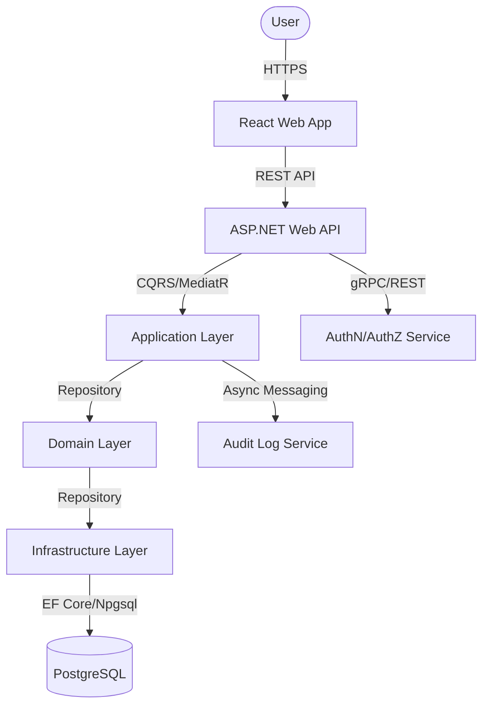
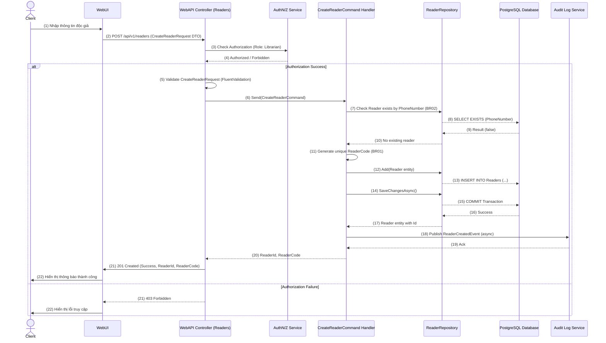
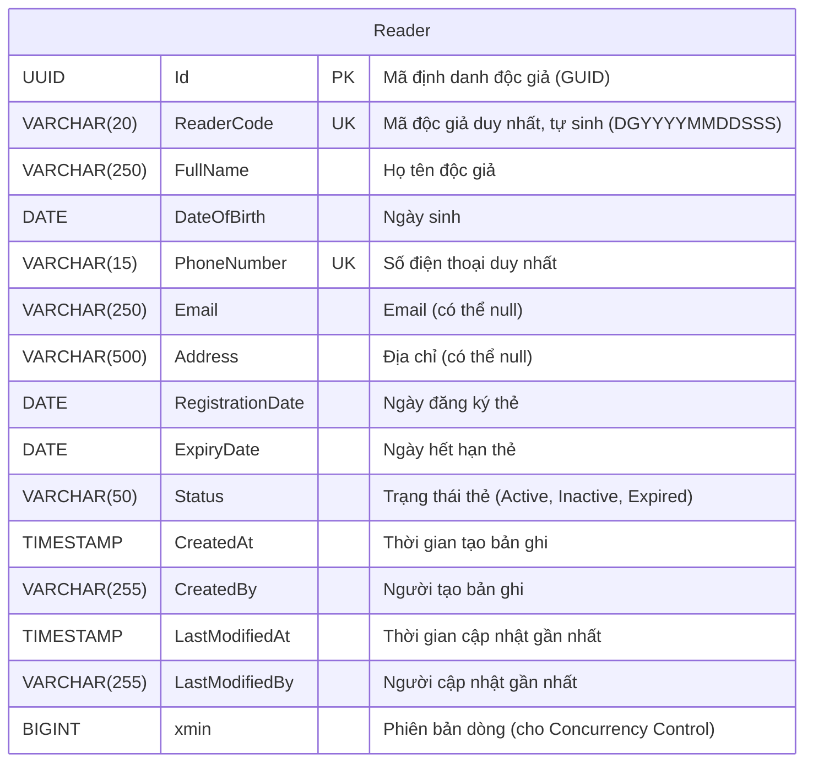

# Software Requirements Specification (SRS) & Solution Architecture Document (SAD)

| Metadata | Giá trị |
|----------|---------|
| **Mã tính năng** | `QUAN-20260601-105011` |
| **Tên tính năng** | Quản lý độc giả |
| **Dự án** | quanlythuvien |
| **Phiên bản** | 1.0 |
| **Ngày tạo** | 2026-06-01 |
| **Tác giả** | SA Agent (ONENET AgentFactory) |

## Tài liệu liên quan

| Mã tính năng | Loại tài liệu | PR | Trạng thái |
|-------------|---------------|-----|------------|
| `QUAN-20260601-105011` | BRD | #7 | ✅ Đã duyệt |
| `QUAN-20260601-105011` | **SRS/SAD** (tài liệu này) | — | ✅ Hiện tại |
| `QUAN-20260601-105011` | DEV (mã nguồn) | — | ⏳ Chờ SRS duyệt |
| `QUAN-20260601-105011` | TEST (test cases) | — | ⏳ Chờ DEV duyệt |

---

# PHẦN I — SRS (Software Requirements Specification)

## 1. Introduction

### 1.1 Purpose
Tài liệu này đặc tả các yêu cầu phần mềm (SRS) và thiết kế kiến trúc hệ thống (SAD) cho tính năng "Quản lý độc giả" trong hệ thống thư viện ONENET. Mục tiêu là cung cấp một tài liệu kỹ thuật chi tiết làm cơ sở cho quá trình phát triển, kiểm thử và triển khai tính năng này, đảm bảo đáp ứng đầy đủ các yêu cầu nghiệp vụ đã được định nghĩa trong BRD PR#7.

### 1.2 Scope
Tính năng "Quản lý độc giả" cho phép thủ thư thực hiện các tác vụ sau:
- Tạo mới thông tin độc giả (bao gồm tự động sinh mã độc giả duy nhất).
- Xem danh sách và chi tiết thông tin độc giả.
- Cập nhật thông tin độc giả đã tồn tại.
- Tìm kiếm và lọc độc giả theo nhiều tiêu chí.
- Đảm bảo các ràng buộc nghiệp vụ về tính duy nhất của mã độc giả và số điện thoại.

Các tính năng ngoài phạm vi bao gồm xóa vĩnh viễn độc giả, tự động gia hạn thẻ, tích hợp hệ thống thanh toán/hội viên bên ngoài, và quản lý hình ảnh đại diện.

### 1.3 Intended Audience
- Đội ngũ phát triển (Developers) để hiểu rõ các yêu cầu và triển khai.
- Đội ngũ kiểm thử (Testers) để xây dựng các kịch bản kiểm thử.
- Business Analysts (BAs) để xác nhận các yêu cầu kỹ thuật đáp ứng nghiệp vụ.
- Project Managers để theo dõi tiến độ và phạm vi dự án.

---

## 2. Overall Description

### 2.1 Product Perspective
Tính năng Quản lý độc giả là một module cốt lõi trong hệ thống quản lý thư viện ONENET, đóng vai trò cung cấp dữ liệu nền tảng cho các module khác như "Quản lý phiếu mượn" và "Quản lý người dùng/phân quyền". Module này được thiết kế để hoạt động như một dịch vụ backend độc lập (microservice hoặc module trong monolith) và tương tác với các module khác thông qua API.

### 2.2 User Roles

| # | Persona | Vai trò | Quyền hạn chính | Mục tiêu sử dụng |
|---|---------|-------|-----------------|------------------|
| 1 | Thủ thư | Người quản lý vận hành thư viện | Tạo, xem, cập nhật thông tin độc giả; kiểm tra trạng thái thẻ độc giả. | Đảm bảo thông tin độc giả chính xác, đầy đủ và hỗ trợ các hoạt động mượn/trả sách hàng ngày. |

### 2.3 Technology Stack

| Layer | Công nghệ |
|-------|----------|
| Backend | .NET 10, ASP.NET Web API |
| Architecture | Clean Architecture, CQRS + MediatR |
| ORM | Entity Framework Core |
| Frontend | React + Mantine UI |
| Database | PostgreSQL |

---

## 3. Functional Requirements

> Tham chiếu từ BRD `QUAN-20260601-105011`

| Mã FR (từ BRD) | Mã SRS | Mô tả kỹ thuật (Technical Logic) | Input Validation | Output Mapping |
|----------------|--------|----------------------------------|------------------|----------------|
| `QUAN-20260601-105011-FR01` | `QUAN-20260601-105011-SRS01` | **Create New Reader:** <br/> 1. Nhận `CreateReaderCommand` (DTO). <br/> 2. Validate DTO (sử dụng FluentValidation). <br/> 3. Kiểm tra tính duy nhất của `PhoneNumber` trong DB (BR02). <br/> 4. Nếu `PhoneNumber` đã tồn tại, trả về lỗi. <br/> 5. Tự động sinh `ReaderCode` theo format `DG[YYYYMMDD][SequentialNumber]` (BR01). <br/> 6. Tạo đối tượng `Reader` entity từ DTO. <br/> 7. Lưu `Reader` entity vào DB. <br/> 8. Ghi lại log audit trail (người tạo, thời gian, dữ liệu). <br/> 9. Commit transaction. | - `FullName`: Bắt buộc, chuỗi, tối đa 250 ký tự. <br/> - `DateOfBirth`: Bắt buộc, kiểu ngày, không được lớn hơn ngày hiện tại. <br/> - `PhoneNumber`: Bắt buộc, chuỗi, định dạng số điện thoại Việt Nam (10 chữ số, bắt đầu bằng 0), duy nhất (BR02). <br/> - `Email`: Không bắt buộc, chuỗi, định dạng email hợp lệ, tối đa 250 ký tự. <br/> - `Address`: Không bắt buộc, chuỗi, tối đa 500 ký tự. <br/> - `RegistrationDate`: Bắt buộc, kiểu ngày, không được lớn hơn ngày hiện tại. <br/> - `ExpiryDate`: Bắt buộc, kiểu ngày, không được nhỏ hơn `RegistrationDate`. <br/> - `Status`: Bắt buộc, enum (mặc định: `Active`). | Trả về `ReaderId` (GUID) và `ReaderCode` của độc giả vừa tạo. |
| `QUAN-20260601-105011-FR02` <br/> `QUAN-20260601-105011-FR04` | `QUAN-20260601-105011-SRS02` | **Get Reader List with Search & Filter:** <br/> 1. Nhận `GetReadersQuery` (DTO) với các tham số tìm kiếm/phân trang/sắp xếp. <br/> 2. Validate DTO (sử dụng FluentValidation) cho các tham số như `PageSize`, `PageIndex`, `SortBy`, `SortOrder`. <br/> 3. Truy vấn DB để lấy danh sách `Reader` entities. <br/> 4. Áp dụng các bộ lọc theo `FullName`, `PhoneNumber`, `Email`, `Status`, `ReaderCode`. <br/> 5. Áp dụng phân trang (paging) và sắp xếp (sorting). <br/> 6. Map `Reader` entities sang `ReaderDto` để trả về. <br/> 7. Trả về danh sách độc giả và thông tin phân trang (tổng số bản ghi, số trang). <br/><br/> **Get Reader By ID:** <br/> 1. Nhận `GetReaderByIdQuery` với `ReaderId`. <br/> 2. Validate `ReaderId` hợp lệ (GUID). <br/> 3. Truy vấn DB để lấy `Reader` entity theo `ReaderId`. <br/> 4. Nếu không tìm thấy, trả về lỗi 404. <br/> 5. Map `Reader` entity sang `ReaderDetailDto` để trả về. | - `SearchTerm`: Không bắt buộc, chuỗi, tối đa 250 ký tự (cho FullName, PhoneNumber, Email, ReaderCode). <br/> - `Status`: Không bắt buộc, enum (Active, Inactive, Expired). <br/> - `PageIndex`: Bắt buộc, số nguyên dương (mặc định 1). <br/> - `PageSize`: Bắt buộc, số nguyên dương (mặc định 10, tối đa 100). <br/> - `SortBy`: Không bắt buộc, chuỗi (các trường cho phép: `FullName`, `ReaderCode`, `RegistrationDate`, `ExpiryDate`). <br/> - `SortOrder`: Không bắt buộc, enum (Asc, Desc). <br/> - `ReaderId`: Bắt buộc, GUID hợp lệ. | **Get Reader List:** Trả về danh sách `ReaderListDto` (gồm `ReaderId`, `ReaderCode`, `FullName`, `PhoneNumber`, `Email`, `Status`, `ExpiryDate`, `RegistrationDate`) và metadata phân trang (TotalCount, PageIndex, PageSize, TotalPages). <br/><br/> **Get Reader By ID:** Trả về `ReaderDetailDto` (gồm tất cả các trường của độc giả). |
| `QUAN-20260601-105011-FR03` | `QUAN-20260601-105011-SRS03` | **Update Reader Information:** <br/> 1. Nhận `UpdateReaderCommand` (DTO) và `ReaderId`. <br/> 2. Validate DTO (sử dụng FluentValidation) và `ReaderId` hợp lệ. <br/> 3. Truy vấn DB để lấy `Reader` entity theo `ReaderId`. Nếu không tìm thấy, trả về lỗi 404. <br/> 4. Kiểm tra `PhoneNumber` trong DTO: Nếu thay đổi, kiểm tra tính duy nhất của `PhoneNumber` với các độc giả khác (ngoại trừ chính độc giả đang cập nhật) trong DB (BR02). <br/> 5. Nếu `PhoneNumber` trùng, trả về lỗi. <br/> 6. Cập nhật các trường của `Reader` entity từ DTO. <br/> 7. Lưu thay đổi vào DB. <br/> 8. Ghi lại log audit trail (người cập nhật, thời gian, các trường thay đổi cũ/mới). <br/> 9. Commit transaction. | - `ReaderId`: Bắt buộc, GUID hợp lệ. <br/> - Các trường tương tự `QUAN-20260601-105011-SRS01` nhưng không nhất thiết tất cả đều là bắt buộc (ví dụ: có thể cập nhật địa chỉ mà không cần nhập lại ngày sinh). <br/> - `PhoneNumber`: Nếu cung cấp, phải hợp lệ và duy nhất (BR02). <br/> - `ExpiryDate`: Nếu cung cấp, không được nhỏ hơn `RegistrationDate` (nếu có cập nhật `RegistrationDate`). | Trả về `ReaderId` của độc giả vừa cập nhật. |

---

## 4. API Interface Contract

> Đặc tả chi tiết từng API Endpoint dùng trong hệ thống

### 4.1 API: Create Reader (`QUAN-20260601-105011-SRS01`)

- **Method**: `POST`
- **Endpoint**: `/api/v1/readers`
- **Authorization**: `Bearer Token` (Role: `Librarian`)
- **Mô tả**: Tạo mới một hồ sơ độc giả trong hệ thống.

**Request Body:**
```json
{
  "fullName": "string (required, max 250)",
  "dateOfBirth": "YYYY-MM-DD (required)",
  "phoneNumber": "string (required, unique, 10 digits, e.g., 0912345678)",
  "email": "string (optional, max 250, valid email format)",
  "address": "string (optional, max 500)",
  "registrationDate": "YYYY-MM-DD (required, default to current date)",
  "expiryDate": "YYYY-MM-DD (required, must be >= registrationDate)",
  "status": "string (optional, enum: 'Active', 'Inactive', 'Expired', default: 'Active')"
}
```

**Response (201 Created):**
```json
{
  "success": true,
  "data": {
    "readerId": "3fa85f64-5717-4562-b3fc-2c963f66afa6",
    "readerCode": "DG20260601001"
  }
}
```

**Response (400 Bad Request - Validation Error):**
```json
{
  "success": false,
  "message": "One or more validation errors occurred.",
  "errors": [
    { "field": "fullName", "message": "'Full Name' must not be empty." },
    { "field": "phoneNumber", "message": "Phone number '0912345678' already exists." },
    { "field": "expiryDate", "message": "'Expiry Date' must be greater than or equal to 'Registration Date'." }
  ]
}
```

**Response (401 Unauthorized):**
```json
{
  "success": false,
  "message": "Unauthorized"
}
```

**Response (403 Forbidden):**
```json
{
  "success": false,
  "message": "Forbidden. User does not have sufficient permissions."
}
```

### 4.2 API: Get Readers List & Search (`QUAN-20260601-105011-SRS02`)

- **Method**: `GET`
- **Endpoint**: `/api/v1/readers`
- **Authorization**: `Bearer Token` (Role: `Librarian`, `Viewer`)
- **Mô tả**: Lấy danh sách độc giả với khả năng tìm kiếm, lọc và phân trang.

**Request Query Parameters:**
- `searchTerm`: `string (optional)` - Tìm kiếm theo `FullName`, `PhoneNumber`, `Email`, `ReaderCode`.
- `status`: `string (optional, enum: 'Active', 'Inactive', 'Expired')` - Lọc theo trạng thái thẻ.
- `pageIndex`: `int (optional, default: 1)` - Số trang.
- `pageSize`: `int (optional, default: 10, max: 100)` - Số lượng bản ghi mỗi trang.
- `sortBy`: `string (optional, enum: 'FullName', 'ReaderCode', 'RegistrationDate', 'ExpiryDate', default: 'FullName')` - Sắp xếp theo trường.
- `sortOrder`: `string (optional, enum: 'Asc', 'Desc', default: 'Asc')` - Thứ tự sắp xếp.

**Response (200 OK):**
```json
{
  "success": true,
  "data": {
    "items": [
      {
        "readerId": "3fa85f64-5717-4562-b3fc-2c963f66afa6",
        "readerCode": "DG20260601001",
        "fullName": "Nguyễn Văn A",
        "phoneNumber": "0912345678",
        "email": "a.nguyen@example.com",
        "status": "Active",
        "registrationDate": "2026-06-01",
        "expiryDate": "2027-06-01"
      },
      // ... more reader items
    ],
    "pageIndex": 1,
    "pageSize": 10,
    "totalCount": 100,
    "totalPages": 10
  }
}
```

**Response (400 Bad Request - Validation Error):**
```json
{
  "success": false,
  "message": "One or more validation errors occurred.",
  "errors": [
    { "field": "pageSize", "message": "'Page Size' must be between 1 and 100." }
  ]
}
```

### 4.3 API: Get Reader by ID (`QUAN-20260601-105011-SRS02`)

- **Method**: `GET`
- **Endpoint**: `/api/v1/readers/{id}`
- **Authorization**: `Bearer Token` (Role: `Librarian`, `Viewer`)
- **Mô tả**: Lấy thông tin chi tiết của một độc giả theo ID.

**Request Path Parameter:**
- `id`: `GUID (required)` - ID của độc giả.

**Response (200 OK):**
```json
{
  "success": true,
  "data": {
    "readerId": "3fa85f64-5717-4562-b3fc-2c963f66afa6",
    "readerCode": "DG20260601001",
    "fullName": "Nguyễn Văn A",
    "dateOfBirth": "1990-01-15",
    "phoneNumber": "0912345678",
    "email": "a.nguyen@example.com",
    "address": "123 Đường ABC, Quận 1, TP.HCM",
    "registrationDate": "2026-06-01",
    "expiryDate": "2027-06-01",
    "status": "Active"
  }
}
```

**Response (404 Not Found):**
```json
{
  "success": false,
  "message": "Reader with ID '3fa85f64-5717-4562-b3fc-2c963f66afa6' not found."
}
```

### 4.4 API: Update Reader (`QUAN-20260601-105011-SRS03`)

- **Method**: `PUT`
- **Endpoint**: `/api/v1/readers/{id}`
- **Authorization**: `Bearer Token` (Role: `Librarian`)
- **Mô tả**: Cập nhật thông tin của một độc giả đã tồn tại.

**Request Path Parameter:**
- `id`: `GUID (required)` - ID của độc giả cần cập nhật.

**Request Body:**
```json
{
  "fullName": "string (optional, max 250)",
  "dateOfBirth": "YYYY-MM-DD (optional)",
  "phoneNumber": "string (optional, unique, 10 digits, e.g., 0912345678)",
  "email": "string (optional, max 250, valid email format)",
  "address": "string (optional, max 500)",
  "registrationDate": "YYYY-MM-DD (optional)",
  "expiryDate": "YYYY-MM-DD (optional, must be >= registrationDate if both provided)",
  "status": "string (optional, enum: 'Active', 'Inactive', 'Expired')"
}
```

**Response (200 OK):**
```json
{
  "success": true,
  "data": {
    "readerId": "3fa85f64-5717-4562-b3fc-2c963f66afa6"
  }
}
```

**Response (400 Bad Request - Validation Error):**
```json
{
  "success": false,
  "message": "One or more validation errors occurred.",
  "errors": [
    { "field": "phoneNumber", "message": "Phone number '0911111111' already exists for another reader." }
  ]
}
```

**Response (404 Not Found):**
```json
{
  "success": false,
  "message": "Reader with ID '3fa85f64-5717-4562-b3fc-2c963f66afa6' not found."
}
```

---

## 5. Non-functional Requirements & Security

### 5.1 Authentication & Authorization
- **AuthN:** Tất cả các API endpoint phải yêu cầu xác thực bằng Bearer Token (JWT). Token phải hợp lệ và được cấp bởi hệ thống xác thực trung tâm.
- **AuthZ:**
    - API `Create Reader` và `Update Reader` yêu cầu quyền `Librarian`.
    - API `Get Readers List` và `Get Reader by ID` yêu cầu quyền `Librarian` hoặc `Viewer`.
    - Phân quyền sẽ được kiểm tra thông qua Policy-based Authorization hoặc Role-based Authorization trên ASP.NET Core, dựa trên claims trong JWT.

### 5.2 Performance & Caching
- **Thời gian phản hồi:** Các thao tác tạo, xem chi tiết, cập nhật độc giả phải hoàn thành trong vòng 1 giây (đạt 90% percentile).
- **Thời gian tải danh sách:** Danh sách độc giả (với tối đa 1000 bản ghi trên một trang) phải được hiển thị trong vòng 3 giây (đạt 90% percentile).
- **Indexing:** Cần tạo index trên các trường `ReaderCode`, `PhoneNumber`, `FullName` (partial index hoặc Full-Text Search nếu cần) để tối ưu hóa truy vấn tìm kiếm và lọc.
- **Caching:** Không áp dụng caching ở tầng ứng dụng cho các thao tác đọc danh sách độc giả ban đầu, do dữ liệu có thể thay đổi thường xuyên. Tuy nhiên, nếu lượng độc giả rất lớn và tần suất thay đổi thấp, có thể cân nhắc caching ở tầng DB hoặc distributed cache.

---

# PHẦN II — SAD (Solution Architecture Document)

## 6. Kiến trúc tổng thể (C4 Container Level)

### 6.1 Architecture Diagram


**Giải thích:**
- **User**: Người dùng cuối, cụ thể là Thủ thư.
- **WebUI (React Web App)**: Ứng dụng giao diện người dùng, cung cấp các màn hình để quản lý độc giả. Giao tiếp với Backend API qua HTTPS.
- **API (ASP.NET Web API)**: Lớp trình bày (Presentation Layer), xử lý các HTTP request, xác thực, ủy quyền, mapping request DTOs tới Commands/Queries và gọi MediatR.
- **AuthN/AuthZ Service**: Hệ thống dịch vụ xác thực và phân quyền bên ngoài (ví dụ: Identity Server, Keycloak) để cấp và xác thực JWT, cũng như cung cấp thông tin về quyền của người dùng.
- **Application Layer**: Chứa các Command Handlers và Query Handlers (sử dụng MediatR), xử lý logic nghiệp vụ, gọi Domain Services và Repository. Đây là nơi kiểm tra các Business Rules chính.
- **Domain Layer**: Chứa các Entity, Value Objects, Domain Services và Interfaces cho Repository.
- **Infrastructure Layer**: Triển khai các Repository interfaces, tích hợp EF Core để tương tác với Database. Chứa các cấu hình cho EF Core (DbContext, Migrations).
- **Database (PostgreSQL)**: Cơ sở dữ liệu quan hệ, lưu trữ toàn bộ thông tin độc giả.
- **Audit Log Service**: Dịch vụ ghi nhật ký độc lập, nhận các sự kiện audit từ Application Layer qua một cơ chế async (ví dụ: message queue) để ghi lại các thao tác thay đổi dữ liệu.

### 6.2 Sequence Diagram (Luồng nghiệp vụ chính - Tạo mới độc giả)

> Sơ đồ tuần tự minh họa tương tác giữa Client, Controller, Handler, và Database



## 7. Thiết kế chi tiết Database (Tham chiếu ERD)

### 7.1 Entity Relationship
> (Chi tiết vui lòng xem tài liệu ERD riêng biệt đính kèm PR này - đây là bản nháp tích hợp)



**Giải thích Entity `Reader`:**
- `Id`: Primary Key, kiểu `UUID` để đảm bảo tính duy nhất toàn cục.
- `ReaderCode`: Unique Key, kiểu `VARCHAR(20)`, tự động sinh theo format `DG[YYYYMMDD][SequentialNumber]`.
- `FullName`: Tên đầy đủ của độc giả.
- `DateOfBirth`: Ngày sinh.
- `PhoneNumber`: Unique Key, kiểu `VARCHAR(15)`, bắt buộc và duy nhất.
- `Email`: Email, không bắt buộc.
- `Address`: Địa chỉ, không bắt buộc.
- `RegistrationDate`: Ngày đăng ký thẻ, mặc định là ngày hiện tại khi tạo mới.
- `ExpiryDate`: Ngày hết hạn thẻ, phải >= `RegistrationDate`.
- `Status`: Trạng thái thẻ, có thể là 'Active', 'Inactive', 'Expired'.
- `CreatedAt`, `CreatedBy`, `LastModifiedAt`, `LastModifiedBy`: Các trường audit để ghi lại lịch sử thay đổi.
- `xmin`: Hidden system column trong PostgreSQL, được sử dụng cho concurrency control optimistic (tương tự RowVersion/Timestamp trong SQL Server).

**Quan hệ:**
- Hiện tại, trong phạm vi tính năng này, bảng `Reader` không có mối quan hệ trực tiếp với các bảng khác được định nghĩa.
- Các module khác (ví dụ: `LoanSlip`) sẽ có khóa ngoại tham chiếu đến `Reader.Id`.

**Indexing Strategy:**
- `PRIMARY KEY (Id)`: Tự động tạo index B-tree.
- `UNIQUE INDEX (ReaderCode)`: Để đảm bảo truy vấn nhanh theo mã độc giả.
- `UNIQUE INDEX (PhoneNumber)`: Để đảm bảo tính duy nhất và truy vấn nhanh theo số điện thoại.
- `INDEX (FullName)`: Để tối ưu hóa tìm kiếm và lọc theo tên.
- `INDEX (Status, ExpiryDate)`: Để tối ưu hóa các truy vấn lọc độc giả theo trạng thái và ngày hết hạn.

**EF Core Configuration / Migration Logic:**
- **`ReaderConfiguration.cs` (in Infrastructure layer):**
    ```csharp
    public class ReaderConfiguration : IEntityTypeConfiguration<Reader>
    {
        public void Configure(EntityTypeBuilder<Reader> builder)
        {
            builder.ToTable("Readers");

            builder.HasKey(r => r.Id);
            builder.Property(r => r.Id).ValueGeneratedOnAdd(); // Or specify a Guid generator

            builder.Property(r => r.ReaderCode).IsRequired().HasMaxLength(20);
            builder.HasIndex(r => r.ReaderCode).IsUnique(); // Unique index for ReaderCode

            builder.Property(r => r.FullName).IsRequired().HasMaxLength(250);
            builder.Property(r => r.DateOfBirth).IsRequired();
            builder.Property(r => r.PhoneNumber).IsRequired().HasMaxLength(15);
            builder.HasIndex(r => r.PhoneNumber).IsUnique(); // Unique index for PhoneNumber

            builder.Property(r => r.Email).HasMaxLength(250); // Not required by default
            builder.Property(r => r.Address).HasMaxLength(500); // Not required by default

            builder.Property(r => r.RegistrationDate).IsRequired();
            builder.Property(r => r.ExpiryDate).IsRequired();
            builder.Property(r => r.Status).IsRequired().HasConversion<string>().HasMaxLength(50); // Store enum as string

            // Audit properties
            builder.Property(r => r.CreatedAt).IsRequired();
            builder.Property(r => r.CreatedBy).IsRequired().HasMaxLength(255);
            builder.Property(r => r.LastModifiedAt);
            builder.Property(r => r.LastModifiedBy).HasMaxLength(255);

            // Concurrency token for optimistic concurrency (PostgreSQL xmin)
            // Note: EF Core doesn't directly map to xmin for concurrency checks by default.
            // A custom concurrency token or database trigger might be needed.
            // For simple cases, manually checking a LastModifiedAt timestamp can be used.
            // If true optimistic concurrency with xmin is needed, a custom provider/interceptor might be required.
            // For now, assume a simple LastModifiedAt check for updates, or `IsConcurrencyToken()` on a dedicated `RowVersion` byte array if on SQL Server.
            // For PostgreSQL, xmin is managed by the DB. We can use a custom approach or trigger.
            // Given the tech stack, we will rely on a LastModifiedAt check within the application logic for now, or consider a dedicated `RowVersion` field if explicit database-level concurrency is strictly required by `ONENET.AgentFactory` standards for PostgreSQL.
        }
    }
    ```
- **Migration Logic:** EF Core migrations sẽ tự động tạo bảng `Readers` với các cột và ràng buộc được định nghĩa.
    - `Add-Migration AddReaderEntity`
    - `Update-Database`

### 7.2 Data Seeding (Dữ liệu mẫu)
- Không có yêu cầu về dữ liệu mẫu (seed data) cụ thể cho bảng `Reader` trong BRD. Dữ liệu độc giả sẽ được tạo thông qua giao diện người dùng.
- Tuy nhiên, các bảng lookup hoặc cấu hình liên quan đến `Status` của độc giả (nếu có định nghĩa là một bảng riêng) sẽ cần seed data ban đầu.

---

## 8. Application Layer Details (Commands/Queries)

| # | Type | Class Name | Mã SRS | Ý nghĩa & Logic chính |
|---|------|-----------|--------|-----------------------|
| 1 | Command | `CreateReaderCommand` | `QUAN-20260601-105011-SRS01` | Chứa DTO đầu vào để tạo độc giả. Handler sẽ validate, kiểm tra trùng SĐT, sinh mã độc giả, tạo entity và lưu vào DB. |
| 2 | Command | `UpdateReaderCommand` | `QUAN-20260601-105011-SRS03` | Chứa DTO đầu vào và `ReaderId` để cập nhật độc giả. Handler sẽ validate, kiểm tra trùng SĐT (ngoại trừ chính độc giả), cập nhật entity và lưu vào DB. |
| 3 | Query | `GetReadersQuery` | `QUAN-20260601-105011-SRS02` | Chứa các tham số để tìm kiếm, lọc và phân trang độc giả. Handler sẽ truy vấn DB, áp dụng các bộ lọc, phân trang, và map kết quả sang DTO. |
| 4 | Query | `GetReaderByIdQuery` | `QUAN-20260601-105011-SRS02` | Chứa `ReaderId` để lấy chi tiết độc giả. Handler sẽ truy vấn DB theo ID và map kết quả sang DTO. |

---

## 9. Rủi ro và giảm thiểu

| # | Rủi ro | Mức độ | Giảm thiểu |
|---|--------|--------|-----------|
| 1 | **Concurrency Issue (Cập nhật đồng thời)**: Hai thủ thư cùng lúc cập nhật thông tin của cùng một độc giả, dẫn đến mất dữ liệu của một người. | High | **Sử dụng cơ chế kiểm soát phiên bản (Optimistic Concurrency):** <br/> - **Client-side:** Khi lấy dữ liệu độc giả để sửa, lưu trữ giá trị `LastModifiedAt`. Khi gửi yêu cầu cập nhật, gửi kèm `LastModifiedAt` này. <br/> - **Server-side:** Trước khi lưu, kiểm tra `LastModifiedAt` trong DB có khớp với giá trị gửi lên từ client không. Nếu không khớp, tức là dữ liệu đã bị thay đổi bởi người khác, hệ thống sẽ từ chối cập nhật và trả về lỗi `409 Conflict`, yêu cầu người dùng tải lại dữ liệu mới nhất để sửa. <br/> - **Database (PostgreSQL `xmin`):** Mặc dù EF Core không có `RowVersion` trực tiếp cho PostgreSQL, `xmin` có thể được sử dụng ở tầng DB hoặc thông qua một cột `timestamp` cập nhật tự động bằng trigger. Hiện tại, sẽ dựa vào `LastModifiedAt` do ứng dụng quản lý hoặc một cột `ConcurrencyToken` kiểu `byte[]` được EF Core quản lý. |
| 2 | **Data Duplication (Trùng SĐT):** Race condition khi hai yêu cầu tạo/cập nhật độc giả với cùng một số điện thoại được xử lý gần như đồng thời, có thể lách qua bước kiểm tra trùng lặp ban đầu. | Medium | **Ràng buộc duy nhất ở tầng Database:** Ngoài việc kiểm tra ở tầng ứng dụng, ràng buộc `UNIQUE INDEX` trên cột `PhoneNumber` của bảng `Reader` sẽ đảm bảo tính toàn vẹn dữ liệu ở cấp độ cơ sở dữ liệu. Nếu có race condition, DB sẽ từ chối yêu cầu thứ hai. |
| 3 | **Performance Degradation (Danh sách/tìm kiếm):** Khi số lượng độc giả tăng lên (ví dụ: >100,000), việc truy vấn danh sách hoặc tìm kiếm có thể chậm. | Medium | - **Indexing:** Đảm bảo các chỉ mục đã được tạo trên các trường tìm kiếm (`FullName`, `PhoneNumber`, `ReaderCode`, `Status`, `ExpiryDate`). <br/> - **Phân trang (Paging):** Bắt buộc sử dụng phân trang cho tất cả các truy vấn danh sách. <br/> - **Tối ưu hóa truy vấn:** Sử dụng `AsNoTracking()` cho các truy vấn đọc để tránh overhead của EF Core Change Tracker. <br/> - **Database tuning:** Định kỳ kiểm tra hiệu suất truy vấn, tối ưu hóa các câu lệnh SQL được sinh ra bởi EF Core. |
| 4 | **Unauthorized Access:** Người dùng không có quyền (ví dụ: không phải Thủ thư) cố gắng tạo/cập nhật thông tin độc giả. | High | **Kiểm tra phân quyền chặt chẽ:** <br/> - Áp dụng `[Authorize(Roles = "Librarian")]` trên các Controller/Endpoint hoặc sử dụng Policy-based Authorization. <br/> - Đảm bảo rằng việc kiểm tra quyền được thực hiện ở đầu mỗi luồng xử lý yêu cầu (trong API Controller hoặc MediatR pipeline). |

---

## 10. Danh sách Files cần tạo/sửa (Implementation Plan)

| # | File Path | Loại | Mã SRS |
|---|----------|------|--------|
| 1 | `src/ONENET.Domain/Entities/Reader.cs` | New | `QUAN-20260601-105011-SRS01` |
| 2 | `src/ONENET.Domain/Events/ReaderCreatedEvent.cs` | New | `QUAN-20260601-105011-SRS01` |
| 3 | `src/ONENET.Application/Features/Readers/Commands/CreateReader/CreateReaderCommand.cs` | New | `QUAN-20260601-105011-SRS01` |
| 4 | `src/ONENET.Application/Features/Readers/Commands/CreateReader/CreateReaderCommandValidator.cs` | New | `QUAN-20260601-105011-SRS01` |
| 5 | `src/ONENET.Application/Features/Readers/Commands/CreateReader/CreateReaderCommandHandler.cs` | New | `QUAN-20260601-105011-SRS01` |
| 6 | `src/ONENET.Application/Features/Readers/Commands/UpdateReader/UpdateReaderCommand.cs` | New | `QUAN-20260601-105011-SRS03` |
| 7 | `src/ONENET.Application/Features/Readers/Commands/UpdateReader/UpdateReaderCommandValidator.cs` | New | `QUAN-20260601-105011-SRS03` |
| 8 | `src/ONENET.Application/Features/Readers/Commands/UpdateReader/UpdateReaderCommandHandler.cs` | New | `QUAN-20260601-105011-SRS03` |
| 9 | `src/ONENET.Application/Features/Readers/Queries/GetReaders/GetReadersQuery.cs` | New | `QUAN-20260601-105011-SRS02` |
| 10 | `src/ONENET.Application/Features/Readers/Queries/GetReaders/GetReadersQueryHandler.cs` | New | `QUAN-20260601-105011-SRS02` |
| 11 | `src/ONENET.Application/Features/Readers/Queries/GetReaders/ReaderListDto.cs` | New | `QUAN-20260601-105011-SRS02` |
| 12 | `src/ONENET.Application/Features/Readers/Queries/GetReaderById/GetReaderByIdQuery.cs` | New | `QUAN-20260601-105011-SRS02` |
| 13 | `src/ONENET.Application/Features/Readers/Queries/GetReaderById/GetReaderByIdQueryHandler.cs` | New | `QUAN-20260601-105011-SRS02` |
| 14 | `src/ONENET.Application/Features/Readers/Queries/GetReaderById/ReaderDetailDto.cs` | New | `QUAN-20260601-105011-SRS02` |
| 15 | `src/ONENET.Application/Common/Interfaces/IReaderRepository.cs` | New | `QUAN-20260601-105011-SRS01` |
| 16 | `src/ONENET.Infrastructure/Persistence/Configurations/ReaderConfiguration.cs` | New | `QUAN-20260601-105011-SRS01` |
| 17 | `src/ONENET.Infrastructure/Persistence/Repositories/ReaderRepository.cs` | New | `QUAN-20260601-105011-SRS01` |
| 18 | `src/ONENET.Infrastructure/Persistence/ApplicationDbContext.cs` | Modify | `QUAN-20260601-105011-SRS01` |
| 19 | `src/ONENET.WebAPI/Controllers/ReadersController.cs` | New | `QUAN-20260601-105011-SRS01` |
| 20 | `src/ONENET.WebAPI/Services/CurrentUserService.cs` | Modify | `QUAN-20260601-105011-SRS01` |
| 21 | `src/ONENET.Infrastructure/Migrations/20260601XXXXXX_AddReaderEntity.cs` | New | `QUAN-20260601-105011-SRS01` |
| 22 | `src/ONENET.Application/Common/Utilities/ReaderCodeGenerator.cs` | New | `QUAN-20260601-105011-SRS01` |

---

_Mã tính năng `QUAN-20260601-105011` — Tài liệu SRS/SAD được sinh tự động bởi ONENET AgentFactory._