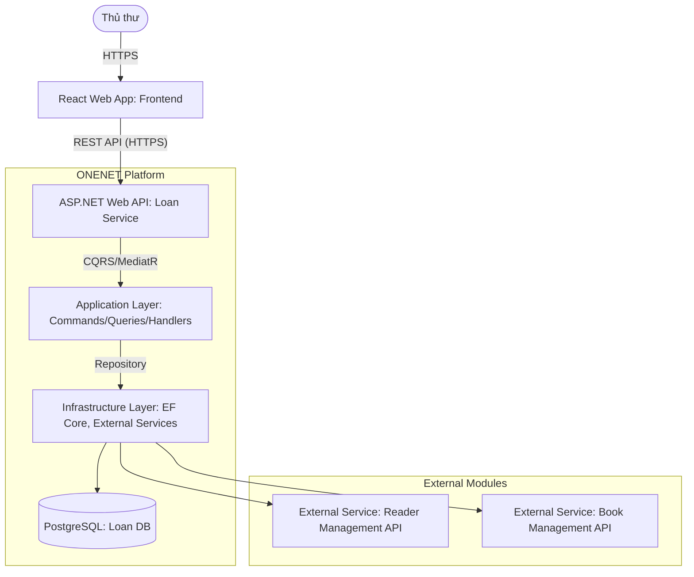
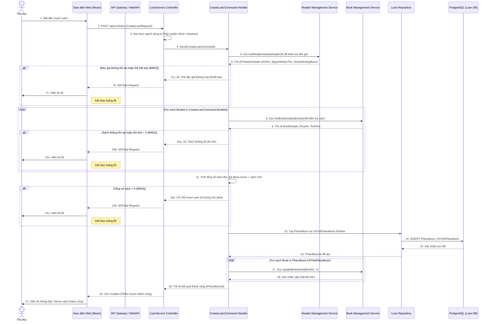

# Software Requirements Specification (SRS) & Solution Architecture Document (SAD)

| Metadata | Giá trị |
|----------|---------|
| **Mã tính năng** | `QUAN-20260601-140229` |
| **Tên tính năng** | Quản lý mượn trả sách |
| **Dự án** | quanlythuvien |
| **Phiên bản** | 1.0 |
| **Ngày tạo** | 2026-06-01 |
| **Tác giả** | SA Agent (ONENET AgentFactory) |

## Tài liệu liên quan

| Mã tính năng | Loại tài liệu | PR | Trạng thái |
|-------------|---------------|-----|------------|
| `QUAN-20260601-140229` | BRD | #9 | ✅ Đã duyệt |
| `QUAN-20260601-140229` | **SRS/SAD** (tài liệu này) | — | ✅ Hiện tại |
| `QUAN-20260601-140229` | DEV (mã nguồn) | — | ⏳ Chờ SRS duyệt |
| `QUAN-20260601-140229` | TEST (test cases) | — | ⏳ Chờ DEV duyệt |

---

# PHẦN I — SRS (Software Requirements Specification)

## 1. Introduction

### 1.1 Purpose
Tài liệu này đặc tả các yêu cầu phần mềm (SRS) và thiết kế kiến trúc giải pháp (SAD) cho tính năng "Quản lý mượn trả sách" trong hệ thống thư viện. Mục tiêu là cung cấp một nền tảng kỹ thuật chi tiết để phát triển một tính năng cho phép Thủ thư thực hiện các nghiệp vụ mượn và trả sách cho độc giả một cách chính xác, tuân thủ các quy tắc của thư viện, và hiển thị trạng thái mượn trả rõ ràng, đặc biệt là các trường hợp quá hạn.

### 1.2 Scope
Phạm vi của tài liệu này bao gồm việc thiết kế các API endpoints, cấu trúc cơ sở dữ liệu (ERD), luồng nghiệp vụ kỹ thuật và các quy tắc nghiệp vụ liên quan đến việc tạo phiếu mượn mới, ghi nhận sách đã trả, và theo dõi trạng thái quá hạn của các phiếu mượn. Tài liệu này không bao gồm các chức năng quản lý thông tin chi tiết về sách và độc giả (được giả định là tồn tại ở các module khác) hay các nghiệp vụ nâng cao như tính phí phạt, đặt trước sách, hoặc báo cáo tổng hợp.

### 1.3 Intended Audience
Tài liệu này dành cho:
- **Phát triển viên (Developers):** Để hiểu rõ các yêu cầu chức năng, phi chức năng và thiết kế kỹ thuật, từ đó triển khai mã nguồn.
- **Kiểm thử viên (Testers):** Để xây dựng các kịch bản kiểm thử dựa trên các yêu cầu và tiêu chí chấp nhận.
- **Quản lý dự án (Project Managers):** Để theo dõi tiến độ và phạm vi dự án.
- **Đội ngũ vận hành (Operations Team):** Để hiểu về kiến trúc và các phụ thuộc của hệ thống.
- **Chuyên viên phân tích nghiệp vụ (Business Analysts):** Để xác nhận rằng các yêu cầu nghiệp vụ đã được dịch đúng sang các yêu cầu kỹ thuật.

---

## 2. Overall Description

### 2.1 Product Perspective
Tính năng "Quản lý mượn trả sách" là một thành phần cốt lõi của hệ thống `quanlythuvien`. Nó tương tác với các module `Quản lý Sách` và `Quản lý Độc giả` để thực hiện các nghiệp vụ chính. Hệ thống sẽ cung cấp một giao diện cho Thủ thư để thực hiện các thao tác mượn và trả sách, đảm bảo tính toàn vẹn dữ liệu và tuân thủ các quy tắc nghiệp vụ đã đề ra.

### 2.2 User Roles

| # | Persona | Vai trò | Quyền hạn chính | Mục tiêu sử dụng |
|---|---------|-------|-----------------|------------------|
| 1 | Thủ thư | Quản lý thư viện | Tạo/Ghi nhận phiếu mượn, Ghi nhận trả sách, Xem danh sách mượn trả, Xem trạng thái quá hạn | Thực hiện các nghiệp vụ mượn trả sách hàng ngày một cách hiệu quả, tuân thủ quy định. |

### 2.3 Technology Stack

| Layer | Công nghệ |
|-------|----------|
| Backend | .NET 10, ASP.NET Web API |
| Architecture | Clean Architecture, CQRS + MediatR |
| ORM | Entity Framework Core |
| Frontend | React + Mantine UI |
| Database | PostgreSQL |

---

## 3. Functional Requirements

> Tham chiếu từ BRD `QUAN-20260601-140229`

| Mã FR (từ BRD) | Mã SRS | Mô tả kỹ thuật (Technical Logic) | Input Validation | Output Mapping |
|----------------|--------|----------------------------------|------------------|----------------|
| `QUAN-20260601-140229-FR01` | `QUAN-20260601-140229-SRS01` | **Mượn sách cho độc giả:**<br>1. Tiếp nhận `CreateLoanCommand` bao gồm `DocGiaId` và danh sách `BookIds` từ API.<br>2. Gọi `ReaderManagementService` để xác thực `DocGiaId` và kiểm tra hiệu lực thẻ độc giả (tuân thủ `QUAN-20260601-140229-BR02`). Nếu không hợp lệ hoặc hết hạn, trả về lỗi.<br>3. Gọi `BookManagementService` cho mỗi `BookId` để lấy thông tin tồn kho. Nếu sách không tồn tại hoặc `TonKho <= 0`, trả về lỗi (tuân thủ `QUAN-20260601-140229-BR01`).<br>4. Gọi `ReaderManagementService` để lấy tổng số sách độc giả đang mượn. Nếu (`Số sách đang mượn` + `Số sách yêu cầu mượn`) > 5, trả về lỗi (tuân thủ `QUAN-20260601-140229-BR03`).<br>5. Tạo `PhieuMuon` entity với `DocGiaId`, `NgayMuon` là ngày hiện tại.<br>6. Tính `NgayHenTra` = `NgayMuon` + 14 ngày (tuân thủ `QUAN-20260601-140229-BR04`).<br>7. Với mỗi `BookId`, tạo `ChiTietPhieuMuon` entity, gắn vào `PhieuMuon` và thiết lập `TrangThaiChiTiet = DangMuon`, `IsQuaHan = false`.<br>8. Gọi `BookManagementService` để cập nhật giảm `TonKho` đi 1 cho mỗi cuốn sách được mượn.<br>9. Lưu các Entity `PhieuMuon` và `ChiTietPhieuMuon` vào cơ sở dữ liệu.<br>10. Ghi nhận log Audit Trail cho giao dịch mượn sách thành công. | **CreateLoanRequest DTO:**<br>- `ReaderId`: UUID (Bắt buộc, phải là UUID hợp lệ)<br>- `BookIds`: `List<UUID>` (Bắt buộc, không rỗng, mỗi phần tử phải là UUID hợp lệ. Số lượng phần tử không quá 5 - kiểm tra bởi BR03). | **Thành công (201 Created):**<br>`{ "loanId": "UUID của phiếu mượn mới" }`<br>**Thất bại (400 Bad Request):**<br>`{ "message": "Lỗi cụ thể", "errors": [...] }` (e.g., "Sách không đủ tồn kho", "Thẻ độc giả hết hiệu lực", "Đã mượn quá số lượng cho phép"). |
| `QUAN-20260601-140229-FR02` | `QUAN-20260601-140229-SRS02` | **Ghi nhận trả sách:**<br>1. Tiếp nhận `RecordBookReturnCommand` với `ChiTietPhieuMuonId` từ API.<br>2. Truy xuất `ChiTietPhieuMuon` theo `ChiTietPhieuMuonId`. Nếu không tìm thấy hoặc đã được trả trước đó, trả về lỗi.<br>3. Cập nhật `NgayTraThucTe` của `ChiTietPhieuMuon` là ngày hiện tại.<br>4. Cập nhật `TrangThaiChiTiet = DaTra`.<br>5. So sánh `NgayTraThucTe` với `NgayHenTra` của `PhieuMuon` cha. Nếu `NgayTraThucTe > NgayHenTra`, thiết lập `IsQuaHan = true` (tuân thủ `QUAN-20260601-140229-BR06`).<br>6. Gọi `BookManagementService` để cập nhật tăng `TonKho` đi 1 cho `SachId` tương ứng (tuân thủ `QUAN-20260601-140229-BR05`).<br>7. Cập nhật `PhieuMuon` cha nếu tất cả các `ChiTietPhieuMuon` của phiếu đó đã được trả (cập nhật `TrangThaiPhieuMuon = DaTraHoanTat`).<br>8. Lưu các thay đổi vào cơ sở dữ liệu.<br>9. Ghi nhận log Audit Trail cho giao dịch trả sách thành công. | **RecordBookReturnRequest DTO:**<br>- `LoanDetailId`: UUID (Bắt buộc, phải là UUID hợp lệ) | **Thành công (200 OK):**<br>`{ "loanDetailId": "UUID của chi tiết phiếu mượn", "isOverdue": "boolean" }`<br>**Thất bại (400 Bad Request / 404 Not Found):**<br>`{ "message": "Lỗi cụ thể" }` (e.g., "Chi tiết phiếu mượn không tồn tại", "Sách đã được trả"). |
| `QUAN-20260601-140229-FR03` | `QUAN-20260601-140229-SRS03` | **Hiển thị trạng thái quá hạn:**<br>1. Tiếp nhận `GetLoansQuery` (có thể kèm các bộ lọc như `ReaderId`, `IsOverdue`) hoặc `GetOverdueLoansQuery` từ API.<br>2. Truy vấn `PhieuMuon` và các `ChiTietPhieuMuon` liên quan.<br>3. Để hiển thị trạng thái quá hạn một cách hiệu quả, hệ thống sẽ thực hiện các bước sau:<br>    - **Tại thời điểm trả sách (SRS02):** Cập nhật `IsQuaHan = true` cho `ChiTietPhieuMuon` nếu `NgayTraThucTe > NgayHenTra` của `PhieuMuon` cha.<br>    - **Đối với các sách chưa trả:** Khi truy vấn danh sách phiếu mượn, kiểm tra các `ChiTietPhieuMuon` có `TrangThaiChiTiet = DangMuon` và `PhieuMuon.NgayHenTra < Ngày hiện tại`. Nếu thỏa mãn, đánh dấu `IsQuaHan = true` trên DTO trả về hoặc trong lúc truy vấn, hoặc cập nhật định kỳ (batch job) nếu cần hiệu suất cao hơn cho việc lọc.<br>4. Trả về danh sách DTO của các phiếu mượn (hoặc chi tiết phiếu mượn) kèm trạng thái `IsOverdue` (tuân thủ `QUAN-20260601-140229-BR06`). | **GetLoansQuery DTO/Query Parameters:**<br>- `ReaderId`: UUID (Tùy chọn, lọc theo độc giả)<br>- `IsOverdue`: boolean (Tùy chọn, lọc các phiếu đang quá hạn)<br>- `PageNumber`, `PageSize`: int (Tùy chọn, phân trang) | **Thành công (200 OK):**<br>`{ "success": true, "data": [ { "loanId": "...", "readerName": "...", "bookTitle": "...", "dueDate": "...", "actualReturnDate": "...", "isOverdue": "boolean" } ] }`<br>**Thất bại (400 Bad Request):**<br>`{ "message": "Lỗi tham số truy vấn" }` |

---

## 4. API Interface Contract

> Đặc tả chi tiết từng API Endpoint dùng trong hệ thống

### 4.1 API: Create Loan (`QUAN-20260601-140229-SRS01`)

-   **Method**: `POST`
-   **Endpoint**: `/api/v1/loans`
-   **Authorization**: `Bearer Token` (Role: `Librarian`)
-   **Mô tả**: Tạo một phiếu mượn mới cho độc giả với các cuốn sách được chọn, đồng thời kiểm tra các quy tắc nghiệp vụ về tồn kho, hiệu lực thẻ và giới hạn số lượng sách mượn.

**Request Body:**
```json
{
  "readerId": "c5a0e0d5-1f2e-4a3b-8c7d-9e0f1a2b3c4d", // UUID của độc giả
  "bookIds": [
    "f1a0b0c0-d1e2-3f4a-5b6c-7d8e9f0a1b2c", // UUID của cuốn sách 1
    "a1b2c3d4-e5f6-7a8b-9c0d-1e2f3a4b5c6d"  // UUID của cuốn sách 2
  ]
}
```
-   `readerId`: string (UUID, required) - ID của độc giả.
-   `bookIds`: array of string (UUID, required, min 1, max 5) - Danh sách ID của các cuốn sách độc giả muốn mượn.

**Response (201 Created):**
```json
{
  "success": true,
  "data": {
    "loanId": "b2c3d4e5-f6a7-8b9c-0d1e-2f3a4b5c6d7e" // ID của phiếu mượn vừa được tạo
  },
  "message": "Phiếu mượn được tạo thành công."
}
```

**Response (400 Bad Request - Business Rule Violation or Validation Error):**
```json
{
  "success": false,
  "message": "Validation Error",
  "errors": [
    {
      "field": "bookIds",
      "message": "Sách 'Title X' không đủ tồn kho."
    },
    {
      "field": "readerId",
      "message": "Thẻ độc giả đã hết hiệu lực."
    }
  ]
}
```
**Response (401 Unauthorized - Invalid Token):**
```json
{
  "success": false,
  "message": "Unauthorized"
}
```
**Response (403 Forbidden - Insufficient Permissions):**
```json
{
  "success": false,
  "message": "Forbidden: Người dùng không có quyền thực hiện thao tác này."
}
```

---

### 4.2 API: Record Book Return (`QUAN-20260601-140229-SRS02`)

-   **Method**: `PUT`
-   **Endpoint**: `/api/v1/loans/{loanDetailId}/return`
-   **Authorization**: `Bearer Token` (Role: `Librarian`)
-   **Mô tả**: Ghi nhận việc trả một cuốn sách cụ thể thuộc một phiếu mượn, cập nhật tồn kho và xác định trạng thái quá hạn.

**Path Parameters:**
-   `loanDetailId`: string (UUID, required) - ID của chi tiết phiếu mượn (đại diện cho một cuốn sách cụ thể trong phiếu mượn).

**Request Body:** (Empty, hoặc có thể thêm `actualReturnDate` nếu muốn cho phép nhập thủ công)
```json
{}
```

**Response (200 OK):**
```json
{
  "success": true,
  "data": {
    "loanDetailId": "d3e4f5a6-b7c8-9d0e-1f2a-3b4c5d6e7f8a",
    "isOverdue": true // True nếu sách được trả muộn hơn ngày hẹn trả
  },
  "message": "Sách đã được ghi nhận trả thành công."
}
```

**Response (400 Bad Request - Business Rule Violation or Validation Error):**
```json
{
  "success": false,
  "message": "Sách đã được trả trước đó."
}
```
**Response (404 Not Found):**
```json
{
  "success": false,
  "message": "Chi tiết phiếu mượn không tồn tại."
}
```

---

### 4.3 API: Get Loans (including Overdue status) (`QUAN-20260601-140229-SRS03`)

-   **Method**: `GET`
-   **Endpoint**: `/api/v1/loans`
-   **Authorization**: `Bearer Token` (Role: `Librarian`)
-   **Mô tả**: Lấy danh sách các phiếu mượn hoặc chi tiết phiếu mượn, có thể lọc theo độc giả hoặc trạng thái quá hạn.

**Query Parameters:**
-   `readerId`: string (UUID, optional) - Lọc các phiếu mượn của một độc giả cụ thể.
-   `isOverdue`: boolean (optional) - `true` để chỉ lấy các phiếu/chi tiết phiếu đang quá hạn.
-   `pageNumber`: int (optional, default 1) - Số trang.
-   `pageSize`: int (optional, default 10) - Số lượng mục trên mỗi trang.

**Response (200 OK):**
```json
{
  "success": true,
  "data": {
    "items": [
      {
        "loanId": "b2c3d4e5-f6a7-8b9c-0d1e-2f3a4b5c6d7e",
        "readerId": "c5a0e0d5-1f2e-4a3b-8c7d-9e0f1a2b3c4d",
        "readerName": "Nguyễn Văn A",
        "loanDate": "2026-06-01",
        "dueDate": "2026-06-15",
        "loanStatus": "DangMuon", // DangMuon, DaTraHoanTat
        "details": [
          {
            "loanDetailId": "d3e4f5a6-b7c8-9d0e-1f2a-3b4c5d6e7f8a",
            "bookId": "f1a0b0c0-d1e2-3f4a-5b6c-7d8e9f0a1b2c",
            "bookTitle": "Lập trình C#",
            "actualReturnDate": null, // null nếu chưa trả
            "detailStatus": "DangMuon", // DangMuon, DaTra
            "isOverdue": true // Calculated: (actualReturnDate == null && now > dueDate) || (actualReturnDate > dueDate)
          },
          {
            "loanDetailId": "e4f5a6b7-c8d9-0e1f-2a3b-4c5d6e7f8a9b",
            "bookId": "a1b2c3d4-e5f6-7a8b-9c0d-1e2f3a4b5c6d",
            "bookTitle": "Giải tích 1",
            "actualReturnDate": "2026-06-14",
            "detailStatus": "DaTra",
            "isOverdue": false
          }
        ]
      }
    ],
    "pageNumber": 1,
    "pageSize": 10,
    "totalCount": 1
  },
  "message": "Lấy danh sách phiếu mượn thành công."
}
```

---

## 5. Non-functional Requirements & Security

### 5.1 Authentication & Authorization
-   **Authentication (AuthN):** Tất cả các API của tính năng quản lý mượn trả sách yêu cầu người dùng phải được xác thực thông qua JSON Web Token (JWT) hợp lệ. Token này phải được gửi trong header `Authorization` dưới dạng `Bearer Token`.
-   **Authorization (AuthZ):**
    -   Chỉ người dùng có vai trò `Librarian` mới được phép truy cập và thực hiện các thao tác `Create Loan` và `Record Book Return`.
    -   Các API truy vấn (ví dụ: `Get Loans`) cũng yêu cầu vai trò `Librarian`.
    -   Hệ thống sẽ sử dụng Policy-based Authorization (ví dụ: ASP.NET Core Policies) để kiểm tra quyền truy cập ở tầng API Controller.

### 5.2 Performance & Caching
-   **Performance:**
    -   Để đảm bảo thời gian phản hồi dưới 2 giây cho các thao tác đơn lẻ, cần tối ưu hóa các truy vấn database bằng cách sử dụng các chỉ mục (indexes) phù hợp trên các trường `DocGiaId`, `NgayHenTra`, `TrangThaiPhieuMuon` trong bảng `PhieuMuon`, và `PhieuMuonId`, `SachId`, `TrangThaiChiTiet`, `IsQuaHan` trong bảng `ChiTietPhieuMuon`.
    -   Các cuộc gọi đến `ReaderManagementService` và `BookManagementService` cần được tối ưu hóa về tốc độ phản hồi từ các module đó. Có thể cân nhắc cơ chế caching cục bộ (in-memory cache) cho dữ liệu sách hoặc độc giả ít thay đổi nếu các module đó chậm phản hồi.
-   **Caching:**
    -   Không có chiến lược caching cụ thể được đề xuất ở giai đoạn ban đầu cho dữ liệu mượn trả (do tính chất thay đổi thường xuyên).
    -   Dữ liệu từ các module bên ngoài (`DocGia`, `Sach`) có thể được cache trong bộ nhớ của `LoanService` trong một thời gian ngắn nếu chúng được truy vấn nhiều lần trong một phiên làm việc hoặc nếu module bên ngoài có độ trễ cao.

---

# PHẦN II — SAD (Solution Architecture Document)

## 6. Kiến trúc tổng thể (C4 Container Level)

### 6.1 Architecture Diagram



### 6.2 Sequence Diagram (Luồng nghiệp vụ chính - Mượn Sách)

> Sơ đồ tuần tự minh họa tương tác giữa Client, Controller, Handler, và Database, bao gồm các dịch vụ ngoài.



---

## 7. Thiết kế chi tiết Database (Tham chiếu ERD)

### 7.1 Entity Relationship
> (Chi tiết vui lòng xem tài liệu ERD riêng biệt đính kèm PR này)
Dưới đây là sơ đồ ERD cho tính năng Quản lý Mượn Trả Sách. Các bảng `DocGia` và `Sach` được hiển thị để minh họa mối quan hệ, tuy nhiên, chúng được quản lý bởi các module riêng biệt và chỉ các thuộc tính cần thiết cho tính năng này được liệt kê.

```mermaid
erDiagram
    DocGia {
        UUID DocGiaId PK "ID của độc giả (từ Module Quản lý Độc giả)"
        -- Các thuộc tính dưới đây được truy xuất qua API từ Module Quản lý Độc giả --
        -- VARCHAR(255) HoTen
        -- DATE NgayHetHanThe
        -- INT SoSachDangMuon
    }

    Sach {
        UUID SachId PK "ID của sách (từ Module Quản lý Sách)"
        -- Các thuộc tính dưới đây được truy xuất qua API từ Module Quản lý Sách --
        -- VARCHAR(255) TieuDe
        -- INT TonKho
    }

    PhieuMuon {
        UUID PhieuMuonId PK "ID phiếu mượn"
        UUID DocGiaId FK "ID độc giả mượn"
        DATE NgayMuon "Ngày bắt đầu mượn"
        DATE NgayHenTra "Ngày hẹn trả dự kiến"
        VARCHAR(50) TrangThaiPhieuMuon "Trạng thái phiếu mượn (DangMuon, DaTraHoanTat)"
        UUID NguoiTao "ID người tạo"
        TIMESTAMP NgayTao "Thời gian tạo"
        UUID NguoiCapNhatCuoi "ID người cập nhật cuối"
        TIMESTAMP NgayCapNhatCuoi "Thời gian cập nhật cuối"
        BIGINT RowVersion "Token kiểm soát đồng thời (PostgreSQL xmin)"
    }

    ChiTietPhieuMuon {
        UUID ChiTietPhieuMuonId PK "ID chi tiết phiếu mượn"
        UUID PhieuMuonId FK "ID phiếu mượn cha"
        UUID SachId FK "ID sách được mượn"
        DATE NgayTraThucTe "Ngày trả sách thực tế (NULL nếu chưa trả)"
        VARCHAR(50) TrangThaiChiTiet "Trạng thái chi tiết (DangMuon, DaTra)"
        BOOLEAN IsQuaHan "True nếu NgayTraThucTe > NgayHenTra (phiếu cha) hoặc NgayHienTai > NgayHenTra (phiếu cha) và chưa trả"
        UUID NguoiTao "ID người tạo"
        TIMESTAMP NgayTao "Thời gian tạo"
        UUID NguoiCapNhatCuoi "ID người cập nhật cuối"
        TIMESTAMP NgayCapNhatCuoi "Thời gian cập nhật cuối"
        BIGINT RowVersion "Token kiểm soát đồng thời (PostgreSQL xmin)"
    }

    DocGia ||--o{ PhieuMuon : "thuoc ve"
    PhieuMuon ||--o{ ChiTietPhieuMuon : "bao gom"
    Sach ||--o{ ChiTietPhieuMuon : "duoc muon"

    KEY:
    PhieuMuon (DocGiaId) INDEX "Tìm kiếm phiếu mượn theo độc giả"
    PhieuMuon (NgayHenTra) INDEX "Tìm kiếm phiếu mượn theo ngày hẹn trả"
    PhieuMuon (TrangThaiPhieuMuon) INDEX "Lọc phiếu mượn theo trạng thái"
    ChiTietPhieuMuon (PhieuMuonId) INDEX "Tìm kiếm chi tiết theo phiếu mượn"
    ChiTietPhieuMuon (SachId) INDEX "Tìm kiếm chi tiết theo sách"
    ChiTietPhieuMuon (TrangThaiChiTiet) INDEX "Lọc chi tiết theo trạng thái"
    ChiTietPhieuMuon (IsQuaHan) INDEX "Lọc chi tiết sách quá hạn"
```

**Chiến lược Indexing:**
-   `PhieuMuon.DocGiaId`: Index để truy vấn nhanh các phiếu mượn của một độc giả cụ thể.
-   `PhieuMuon.NgayHenTra`: Index để tìm kiếm và lọc các phiếu mượn theo ngày hẹn trả, hỗ trợ việc xác định quá hạn.
-   `PhieuMuon.TrangThaiPhieuMuon`: Index để lọc phiếu mượn theo trạng thái (đang mượn, đã trả).
-   `ChiTietPhieuMuon.PhieuMuonId`: Index để truy xuất nhanh các chi tiết của một phiếu mượn.
-   `ChiTietPhieuMuon.SachId`: Index để tìm kiếm chi tiết phiếu mượn liên quan đến một cuốn sách cụ thể.
-   `ChiTietPhieuMuon.TrangThaiChiTiet`: Index để lọc các sách đang được mượn hoặc đã trả.
-   `ChiTietPhieuMuon.IsQuaHan`: Index để lọc nhanh các sách đang quá hạn.

**EF Core Configuration / Migration Logic:**
-   **Entity Base Class:** Các entities sẽ kế thừa một lớp base chứa các trường audit như `NguoiTao`, `NgayTao`, `NguoiCapNhatCuoi`, `NgayCapNhatCuoi` và `RowVersion`.
-   **UUIDs:** Sử dụng kiểu dữ liệu `UUID` cho khóa chính và khóa ngoại trong PostgreSQL, ánh xạ tới `Guid` trong .NET.
-   **Date/Timestamp:** `DATE` trong PostgreSQL ánh xạ tới `DateOnly` hoặc `DateTime` (.NET). `TIMESTAMP` ánh xạ tới `DateTime` hoặc `DateTimeOffset` (.NET), nên sử dụng `DateTimeOffset` để xử lý múi giờ.
-   **Enums:** Các trường `TrangThaiPhieuMuon` và `TrangThaiChiTiet` (enum) có thể được lưu trữ dưới dạng `string` hoặc `int` trong DB. Sử dụng `HasConversion<string>()` trong EF Core để lưu dưới dạng `string` giúp dễ đọc hơn.
-   **Concurrency Token:** Trường `RowVersion` (BIGINT) sẽ được cấu hình là `IsConcurrencyToken()` trong EF Core để xử lý xung đột đồng thời khi cập nhật bản ghi. Với PostgreSQL `xmin` có thể dùng một thuộc tính `uint` hoặc `ulong` và cấu hình tương ứng hoặc xử lý thủ công. Để đơn giản, sẽ dùng `BIGINT` và `IsConcurrencyToken()`.
-   **Foreign Keys:** Các mối quan hệ 1-nhiều giữa `PhieuMuon` và `ChiTietPhieuMuon` sẽ được cấu hình sử dụng `HasMany().WithOne()` trong `DbContext`. Đối với `DocGiaId` và `SachId`, dù là khóa ngoại logic tới module khác, chúng vẫn được định nghĩa là `Guid` và có thể có ràng buộc `FOREIGN KEY` vật lý nếu `DocGia` và `Sach` nằm cùng schema/database hoặc được quản lý bởi một hệ thống `microservice-aware ORM` có khả năng tạo liên kết xuyên schema/DB. Trong trường hợp này, chúng tôi giả định là liên kết logic và kiểm tra nghiệp vụ qua API.

### 7.2 Data Seeding (Dữ liệu mẫu)
-   Yêu cầu tạo script migration để khởi tạo các `lookup data` hoặc `configuration data` nếu có. Hiện tại, tính năng này không yêu cầu seed data cho các bảng chính `PhieuMuon` hay `ChiTietPhieuMuon`. Tuy nhiên, để kiểm thử, cần có dữ liệu mẫu của `DocGia` và `Sach` từ các module liên quan.

---

## 8. Application Layer Details (Commands/Queries)

| # | Type | Class Name | Mã SRS | Ý nghĩa & Logic chính |
|---|------|-----------|--------|-----------------------|
| 1 | Command | `CreateLoanCommand` | `QUAN-20260601-140229-SRS01` | Validate DTO, gọi External Services kiểm tra BR01, BR02, BR03. Tạo `PhieuMuon` và `ChiTietPhieuMuon` Entities, gọi `BookManagementService` cập nhật tồn kho, lưu vào Repo. |
| 2 | Command | `RecordBookReturnCommand` | `QUAN-20260601-140229-SRS02` | Validate DTO, lấy `ChiTietPhieuMuon`. Cập nhật `NgayTraThucTe`, `TrangThaiChiTiet`, `IsQuaHan` (BR06). Gọi `BookManagementService` cập nhật tồn kho (BR05). Lưu vào Repo. |
| 3 | Query | `GetLoansQuery` | `QUAN-20260601-140229-SRS03` | Truy vấn danh sách `PhieuMuon` và `ChiTietPhieuMuon` từ DB. Áp dụng các bộ lọc (DocGiaId, IsOverdue). Calculate `IsOverdue` cho các sách chưa trả. Trả về DTO với `AsNoTracking()`. |
| 4 | Query | `GetLoanByIdQuery` | (Internal) | Truy vấn chi tiết một phiếu mượn cụ thể. |

---

## 9. Rủi ro và giảm thiểu

| # | Rủi ro | Mức độ | Giảm thiểu |
|---|--------|--------|-----------|
| 1 | Concurrency Issue khi cập nhật tồn kho sách hoặc trạng thái phiếu mượn. | High | Sử dụng `RowVersion` (xmin) của PostgreSQL kết hợp `IsConcurrencyToken()` của EF Core để phát hiện và xử lý xung đột đồng thời. Triển khai retry mechanism cho các giao dịch có thể bị lỗi do concurrency. Đảm bảo các thao tác cập nhật tồn kho từ `BookManagementService` là idempotent và atomic. |
| 2 | Phụ thuộc vào External Services (`ReaderManagementService`, `BookManagementService`) có thể gây ra lỗi hoặc độ trễ. | High | Triển khai Circuit Breaker và Retry Pattern khi gọi External Services. Sử dụng Timeouts cho các cuộc gọi. Cân nhắc caching tạm thời dữ liệu từ các service này (ví dụ: thông tin sách, thông tin thẻ độc giả) nếu chúng ít thay đổi và độ trễ là vấn đề. |
| 3 | Lỗi dữ liệu do ngày giờ hệ thống không chính xác khi tính `NgayHenTra` hoặc xác định `IsOverdue`. | Medium | Đảm bảo server time (UTC) được đồng bộ hóa và cấu hình đúng. Sử dụng `DateTime.UtcNow` hoặc `DateOnly.FromDateTime(DateTime.UtcNow)` để đảm bảo tính nhất quán. |
| 4 | Hiệu suất hệ thống giảm khi có nhiều yêu cầu mượn/trả sách đồng thời hoặc truy vấn danh sách quá hạn. | Medium | Tối ưu hóa database với các chỉ mục đã đề xuất. Tối ưu hóa các query trong EF Core (ví dụ: sử dụng `Select` để chỉ lấy các cột cần thiết, `Include` hợp lý). Triển khai phân trang (Pagination) cho các API trả về danh sách lớn. |
| 5 | Lỗi bảo mật do phân quyền không đúng hoặc token bị lộ. | High | Đảm bảo kiểm tra Authorization chặt chẽ ở tầng API Controller và Application Layer. Sử dụng JWT với thời gian hết hạn ngắn, refresh token an toàn. Áp dụng nguyên tắc Least Privilege (quyền tối thiểu cần thiết). |

---

## 10. Danh sách Files cần tạo/sửa (Implementation Plan)

| # | File Path | Loại | Mã SRS | Mô tả |
|---|----------|------|--------|-------|
| 1 | `src/ONENET.Domain/Entities/PhieuMuon.cs` | New | `QUAN-20260601-140229-SRS01` | Định nghĩa Entity `PhieuMuon` |
| 2 | `src/ONENET.Domain/Entities/ChiTietPhieuMuon.cs` | New | `QUAN-20260601-140229-SRS01` | Định nghĩa Entity `ChiTietPhieuMuon` |
| 3 | `src/ONENET.Domain/Enums/LoanEnums.cs` | New | `QUAN-20260601-140229-SRS01`, `SRS02`, `SRS03` | Định nghĩa các Enum `TrangThaiPhieuMuon`, `TrangThaiChiTiet` |
| 4 | `src/ONENET.Application/Features/Loans/Commands/CreateLoanCommand.cs` | New | `QUAN-20260601-140229-SRS01` | Command để tạo phiếu mượn |
| 5 | `src/ONENET.Application/Features/Loans/Commands/CreateLoanCommandHandler.cs` | New | `QUAN-20260601-140229-SRS01` | Handler xử lý `CreateLoanCommand` |
| 6 | `src/ONENET.Application/Features/Loans/Commands/RecordBookReturnCommand.cs` | New | `QUAN-20260601-140229-SRS02` | Command để ghi nhận trả sách |
| 7 | `src/ONENET.Application/Features/Loans/Commands/RecordBookReturnCommandHandler.cs` | New | `QUAN-20260601-140229-SRS02` | Handler xử lý `RecordBookReturnCommand` |
| 8 | `src/ONENET.Application/Features/Loans/Queries/GetLoansQuery.cs` | New | `QUAN-20260601-140229-SRS03` | Query để lấy danh sách phiếu mượn |
| 9 | `src/ONENET.Application/Features/Loans/Queries/GetLoansQueryHandler.cs` | New | `QUAN-20260601-140229-SRS03` | Handler xử lý `GetLoansQuery` |
| 10 | `src/ONENET.Application/Features/Loans/Dtos/LoanDto.cs` | New | `QUAN-20260601-140229-SRS01`, `SRS02`, `SRS03` | Các DTO cho request/response của các API |
| 11 | `src/ONENET.Application/Interfaces/IBookManagementService.cs` | New | `QUAN-20260601-140229-SRS01`, `SRS02` | Interface cho External Service Book Management |
| 12 | `src/ONENET.Application/Interfaces/IReaderManagementService.cs` | New | `QUAN-20260601-140229-SRS01` | Interface cho External Service Reader Management |
| 13 | `src/ONENET.Infrastructure/Persistence/ApplicationDbContext.cs` | Modify | `QUAN-20260601-140229-SRS01`, `SRS02`, `SRS03` | Thêm `DbSet` cho `PhieuMuon`, `ChiTietPhieuMuon` |
| 14 | `src/ONENET.Infrastructure/Persistence/Configurations/PhieuMuonConfiguration.cs` | New | `QUAN-20260601-140229-SRS01` | EF Core Entity Configuration cho `PhieuMuon` |
| 15 | `src/ONENET.Infrastructure/Persistence/Configurations/ChiTietPhieuMuonConfiguration.cs` | New | `QUAN-20260601-140229-SRS01` | EF Core Entity Configuration cho `ChiTietPhieuMuon` |
| 16 | `src/ONENET.Infrastructure/Services/BookManagementHttpService.cs` | New | `QUAN-20260601-140229-SRS01`, `SRS02` | Triển khai HTTP Client gọi Book Management API |
| 17 | `src/ONENET.Infrastructure/Services/ReaderManagementHttpService.cs` | New | `QUAN-20260601-140229-SRS01` | Triển khai HTTP Client gọi Reader Management API |
| 18 | `src/ONENET.WebAPI/Controllers/LoansController.cs` | New | `QUAN-20260601-140229-SRS01`, `SRS02`, `SRS03` | API Controller cho các thao tác mượn trả sách |
| 19 | `src/ONENET.WebAPI/Program.cs` | Modify | `QUAN-20260601-140229-SRS01`, `SRS02`, `SRS03` | Đăng ký các dịch vụ (MediatR, HttpClients, Authorization Policies) |
| 20 | `src/ONENET.WebAPI/appsettings.json` | Modify | - | Thêm cấu hình cho External Services API URL |
| 21 | `src/ONENET.Infrastructure/Migrations/..._AddLoanManagement.cs` | New | `QUAN-20260601-140229-SRS01` | EF Core Migration để tạo bảng `PhieuMuon`, `ChiTietPhieuMuon` |

---

_Mã tính năng `QUAN-20260601-140229` — Tài liệu SRS/SAD được sinh tự động bởi ONENET AgentFactory._