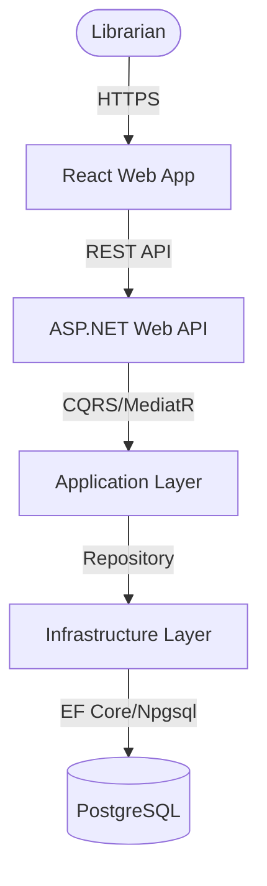
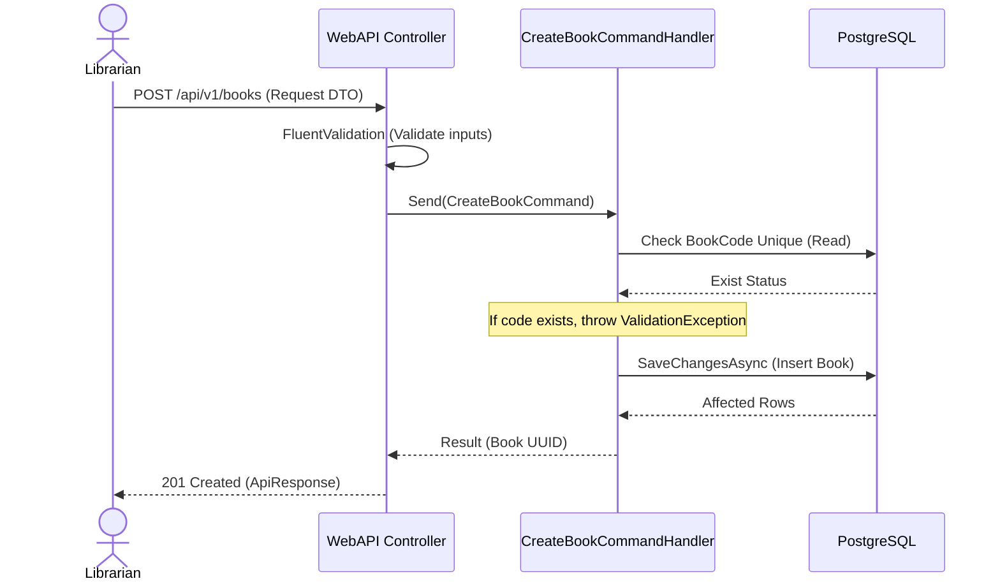

# Software Requirements Specification (SRS) & Solution Architecture Document (SAD)

| Metadata | Giá trị |
|----------|---------|
| **Mã tính năng** | `BRD-01` |
| **Tên tính năng** | Quản lý sách |
| **Dự án** | quanlythuvien |
| **Phiên bản** | 1.0 |
| **Ngày tạo** | 2026-06-01 |
| **Tác giả** | SA Agent (ONENET AgentFactory) |

## Tài liệu liên quan

| Mã tính năng | Loại tài liệu | PR | Trạng thái |
|-------------|---------------|-----|------------|
| `BRD-01` | BRD | #1 | ✅ Đã duyệt |
| `BRD-01` | **SRS/SAD** (tài liệu này) | — | ✅ Hiện tại |
| `BRD-01` | DEV (mã nguồn) | — | ⏳ Chờ SRS duyệt |
| `BRD-01` | TEST (test cases) | — | ⏳ Chờ DEV duyệt |

---

# PHẦN I — SRS (Software Requirements Specification)

## 1. Introduction

### 1.1 Purpose
Tài liệu này đặc tả chi tiết các yêu cầu chức năng (Functional Requirements) và phi chức năng (Non-functional Requirements) cho tính năng **Quản lý sách** thuộc dự án Quản lý Thư viện. Đây là cơ sở để các Developer Agent tiến hành code và các QA Agent viết test case.

### 1.2 Scope
Phạm vi bao gồm các chức năng: Thêm mới sách, Cập nhật thông tin sách, Xóa sách (xóa mềm), và Tìm kiếm/Tra cứu danh mục sách của thư viện.

### 1.3 Intended Audience
Tài liệu này dành cho Developer Agents, QA Agents, DevOps Agents và Tech Lead của dự án.

---

## 2. Overall Description

### 2.1 Product Perspective
Tính năng Quản lý sách là module cốt lõi của hệ thống thư viện, quản lý toàn bộ vòng đời của sách từ lúc nhập kho cho đến khi sẵn sàng cho độc giả mượn hoặc thanh lý.

### 2.2 User Roles
- **Thủ thư (Librarian)**: Người sử dụng chính, có toàn quyền CRUD (Tạo, Đọc, Cập nhật, Xóa) thông tin sách.

### 2.3 Technology Stack

| Layer | Công nghệ |
|-------|----------|
| Backend | .NET 10, ASP.NET Web API |
| Architecture | Clean Architecture, CQRS + MediatR |
| ORM | Entity Framework Core |
| Frontend | React + Mantine UI |
| Database | PostgreSQL |

---

## 3. Functional Requirements

> Tham chiếu từ BRD `BRD-01`

| Mã FR (từ BRD) | Mã SRS | Mô tả kỹ thuật (Technical Logic) | Input Validation | Output Mapping |
|----------------|--------|----------------------------------|------------------|----------------|
| `BRD-01-FR01` | `BRD-01-SRS01` | **Thêm sách mới**: Lưu thông tin sách mới vào Database. Sinh mã BookCode duy nhất nếu không cung cấp và gán trạng thái ban đầu là "Available" hoặc "Hết sách" dựa trên số lượng. | Tên sách: Yêu cầu, max 200 kí tự.<br>Tác giả: Yêu cầu, max 100 kí tự.<br>Số lượng: >= 0.<br>Mã sách: Duy nhất trong DB. | Trả về `Guid` (Id của sách vừa tạo) |
| `BRD-01-FR02` | `BRD-01-SRS02` | **Cập nhật sách**: Thay đổi thông tin sách hiện có theo ID. Cập nhật `Status` thành "Hết sách" nếu `Quantity = 0`, ngược lại là "Available". | ID sách: Guid hợp lệ.<br>Quy tắc validate trường giống như Thêm sách. | Trả về `Result` thành công hoặc thất bại. |
| `BRD-01-FR03` | `BRD-01-SRS03` | **Xóa sách**: Đánh dấu xóa mềm (`IsDeleted = true`). Cần kiểm tra xem sách đó có đang được mượn hay không (không cho phép xóa nếu đang có độc giả mượn). | ID sách: Guid hợp lệ. | Trả về `Result` thành công hoặc thất bại. |
| `BRD-01-FR04` | `BRD-01-SRS04` | **Tra cứu sách**: Tìm kiếm sách có phân trang và lọc theo Tên sách, Tác giả, Thể loại, Trạng thái. | PageNumber >= 1.<br>PageSize từ 1 đến 100. | Trả về danh sách DTO của sách kèm thông tin phân trang. |

---

## 4. API Interface Contract

### 4.1 API: Thêm sách mới (`BRD-01-SRS01`)
- **Method**: `POST`
- **Endpoint**: `/api/v1/books`
- **Authorization**: `Bearer Token` (Role: `Librarian`)
- **Mô tả**: Thủ thư thêm một đầu sách mới vào hệ thống.

**Request:**
```json
{
  "bookCode": "BOOK001",
  "title": "Lập trình C# nâng cao",
  "author": "Nguyễn Văn A",
  "category": "Công nghệ thông tin",
  "publisher": "NXB Giáo Dục",
  "publishYear": 2025,
  "quantity": 10,
  "shelfLocation": "Kệ A1"
}
```

**Response (201 Created):**
```json
{
  "success": true,
  "data": { "id": "3fa85f64-5717-4562-b3fc-2c963f66afa6" },
  "message": "Thêm sách thành công",
  "errors": []
}
```

### 4.2 API: Cập nhật sách (`BRD-01-SRS02`)
- **Method**: `PUT`
- **Endpoint**: `/api/v1/books/{id}`
- **Authorization**: `Bearer Token` (Role: `Librarian`)
- **Mô tả**: Thủ thư cập nhật thông tin của đầu sách theo ID.

**Request:**
```json
{
  "title": "Lập trình C# nâng cao (Tái bản)",
  "author": "Nguyễn Văn A",
  "category": "Công nghệ thông tin",
  "publisher": "NXB Giáo Dục",
  "publishYear": 2026,
  "quantity": 0,
  "shelfLocation": "Kệ A1"
}
```

**Response (200 OK):**
```json
{
  "success": true,
  "data": null,
  "message": "Cập nhật sách thành công",
  "errors": []
}
```

### 4.3 API: Xóa sách (`BRD-01-SRS03`)
- **Method**: `DELETE`
- **Endpoint**: `/api/v1/books/{id}`
- **Authorization**: `Bearer Token` (Role: `Librarian`)
- **Mô tả**: Xóa mềm đầu sách nếu không có độc giả nào đang mượn sách này.

**Response (200 OK):**
```json
{
  "success": true,
  "data": null,
  "message": "Xóa sách thành công",
  "errors": []
}
```

### 4.4 API: Tra cứu sách (`BRD-01-SRS04`)
- **Method**: `GET`
- **Endpoint**: `/api/v1/books`
- **Mô tả**: Tìm kiếm sách có phân trang và bộ lọc.

**Params:**
- `search`: Chuỗi tìm kiếm (Tên sách/Tác giả)
- `category`: Thể loại
- `pageNumber`: Số trang (mặc định 1)
- `pageSize`: Kích thước trang (mặc định 10)

**Response (200 OK):**
```json
{
  "success": true,
  "data": {
    "items": [
      {
        "id": "3fa85f64-5717-4562-b3fc-2c963f66afa6",
        "bookCode": "BOOK001",
        "title": "Lập trình C# nâng cao",
        "author": "Nguyễn Văn A",
        "category": "Công nghệ thông tin",
        "publisher": "NXB Giáo Dục",
        "publishYear": 2025,
        "quantity": 10,
        "shelfLocation": "Kệ A1",
        "status": "Available"
      }
    ],
    "pageNumber": 1,
    "pageSize": 10,
    "totalCount": 1
  },
  "message": null,
  "errors": []
}
```

---

## 5. Non-functional Requirements & Security

### 5.1 Authentication & Authorization
- **AuthN:** API quản lý sách (POST/PUT/DELETE) yêu cầu JWT Token hợp lệ trên header `Authorization`.
- **AuthZ:** Kiểm tra Role `Librarian` trước khi cho phép thay đổi dữ liệu sách.

### 5.2 Performance & Caching
- Index unique cột `book_code` và index cột `title` để tăng tốc độ tìm kiếm.

---

# PHẦN II — SAD (Solution Architecture Document)

## 6. Kiến trúc tổng thể (C4 Container Level)

### 6.1 Architecture Diagram


### 6.2 Sequence Diagram (Thêm sách mới)


---

## 7. Thiết kế chi tiết Database (Tham chiếu ERD)

### 7.1 Entity Relationship
Sách sẽ được lưu vào bảng `books`. Các thuộc tính tương ứng:
- `id`: UUID (Primary Key, BaseEntity)
- `book_code`: VARCHAR(50) (Unique Index, Not Null)
- `title`: VARCHAR(200) (Not Null)
- `author`: VARCHAR(100) (Not Null)
- `category`: VARCHAR(100) (Not Null)
- `publisher`: VARCHAR(100) (Not Null)
- `publish_year`: INT (Not Null)
- `quantity`: INT (Not Null, Default 0)
- `shelf_location`: VARCHAR(50) (Nullable)
- `status`: VARCHAR(20) (Not Null)
- Các trường Audit kế thừa từ `BaseEntity`.

### 7.2 Data Seeding (Dữ liệu mẫu)
Khi chạy migration, hệ thống sẽ thực hiện seeding sẵn một số đầu sách mẫu để kiểm thử.

---

## 8. Application Layer Details (Commands/Queries)

| # | Type | Class Name | Mã SRS | Ý nghĩa & Logic chính |
|---|------|-----------|--------|-----------------------|
| 1 | Command | `CreateBookCommand` | `BRD-01-SRS01` | Tạo thực thể Book mới, kiểm tra BookCode trùng lặp. |
| 2 | Command | `UpdateBookCommand` | `BRD-01-SRS02` | Tìm Book theo ID, cập nhật thông tin và cập nhật Status theo Quantity. |
| 3 | Command | `DeleteBookCommand` | `BRD-01-SRS03` | Kiểm tra trạng thái mượn của Book. Thực hiện soft delete (`IsDeleted = true`). |
| 4 | Query | `GetBooksQuery` | `BRD-01-SRS04` | Lọc, tìm kiếm và phân trang danh sách sách (AsNoTracking). |
| 5 | Query | `GetBookByIdQuery` | `BRD-01-SRS04` | Lấy chi tiết sách theo ID (AsNoTracking). |

---

## 9. Rủi ro và giảm thiểu

| # | Rủi ro | Mức độ | Giảm thiểu |
|---|--------|--------|-----------|
| 1 | Xóa nhầm sách đang mượn | High | Ràng buộc nghiệp vụ ở lớp Application, kiểm tra bảng `borrows` trước khi soft-delete. |
| 2 | Xung đột ghi đồng thời | Medium | Sử dụng cơ chế xmin (RowVersion) của PostgreSQL để phát hiện Concurrency. |

---

## 10. Danh sách Files cần tạo/sửa (Implementation Plan)

| # | File Path | Loại | Mã SRS |
|---|----------|------|--------|
| 1 | `apps/api/src/ONENET.Domain/Entities/Book.cs` | New | `BRD-01-SRS01` |
| 2 | `apps/api/src/ONENET.Domain/Enums/BookStatus.cs` | New | `BRD-01-SRS01` |
| 3 | `apps/api/src/ONENET.Application/Books/Commands/CreateBookCommand.cs` | New | `BRD-01-SRS01` |
| 4 | `apps/api/src/ONENET.Application/Books/Commands/UpdateBookCommand.cs` | New | `BRD-01-SRS02` |
| 5 | `apps/api/src/ONENET.Application/Books/Commands/DeleteBookCommand.cs` | New | `BRD-01-SRS03` |
| 6 | `apps/api/src/ONENET.Application/Books/Queries/GetBooksQuery.cs` | New | `BRD-01-SRS04` |
| 7 | `apps/api/src/ONENET.Application/Books/Queries/GetBookByIdQuery.cs` | New | `BRD-01-SRS04` |
| 8 | `apps/api/src/ONENET.Infrastructure/Persistence/Configurations/BookConfiguration.cs` | New | `BRD-01-SRS01` |
| 9 | `apps/api/src/ONENET.WebAPI/Controllers/BooksController.cs` | New | `BRD-01-SRS01` |

---

_Mã tính năng `BRD-01` — Tài liệu SRS/SAD được sinh tự động bởi ONENET AgentFactory._
