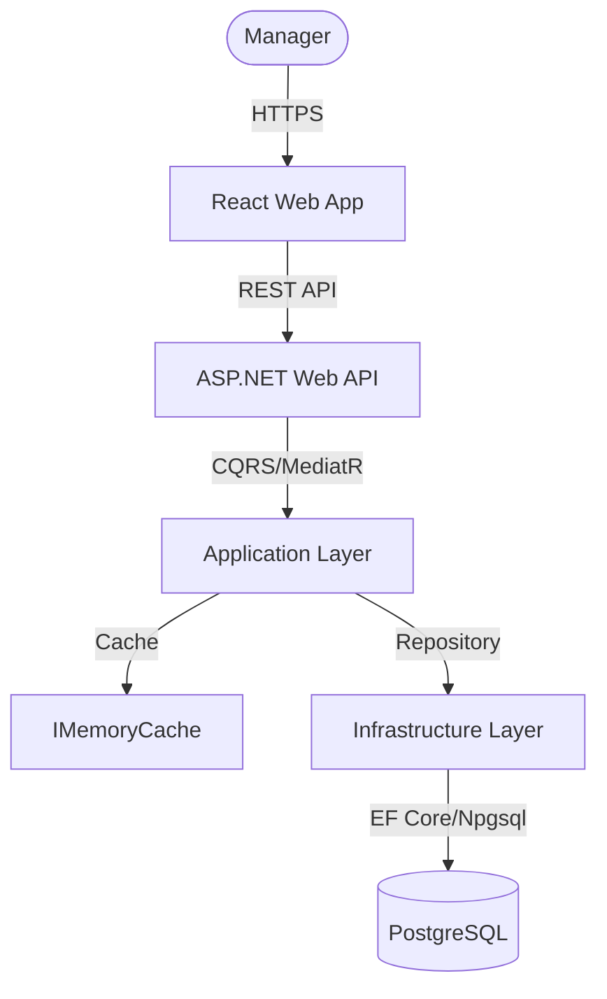
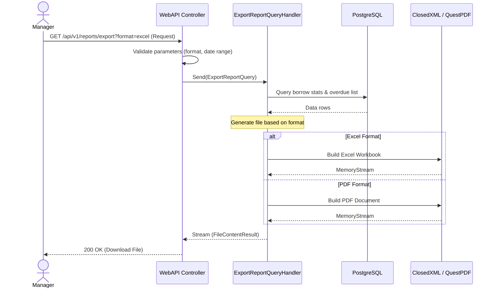

# Software Requirements Specification (SRS) & Solution Architecture Document (SAD)

| Metadata | Giá trị |
|----------|---------|
| **Mã tính năng** | `QUAN-20260601-1634` |
| **Tên tính năng** | Báo cáo thống kê thư viện |
| **Dự án** | quanlythuvien |
| **Phiên bản** | 1.0 |
| **Ngày tạo** | 2026-06-01 |
| **Tác giả** | SA Agent (ONENET AgentFactory) |

## Tài liệu liên quan

| Mã tính năng | Loại tài liệu | PR / Commit | Trạng thái |
|-------------|---------------|-------------|------------|
| `BRD-04` | BRD | PR #4 | ✅ Đã duyệt |
| `BRD-04` | **SRS/SAD** (tài liệu này) | PR #5 | ✅ Hiện tại |
| `BRD-04` | DEV (mã nguồn) | — | ⏳ Chờ SRS duyệt |
| `BRD-04` | TEST (test cases) | — | ⏳ Chờ DEV duyệt |


---

# PHẦN I — SRS (Software Requirements Specification)

## 1. Introduction

### 1.1 Purpose
Tài liệu này đặc tả chi tiết các yêu cầu chức năng (Functional Requirements) và phi chức năng (Non-functional Requirements) cho tính năng **Báo cáo thống kê thư viện** thuộc dự án Quản lý Thư viện. Đây là cơ sở để các Developer Agent tiến hành code và các QA Agent viết test case.

### 1.2 Scope
Phạm vi bao gồm các chức năng: Hiển thị các chỉ số thống kê trên Dashboard tổng quan, Thống kê số lượng mượn sách theo khoảng thời gian, Xếp hạng các sách được mượn nhiều nhất, và hỗ trợ xuất báo cáo định dạng Excel/PDF.

### 1.3 Intended Audience
Tài liệu này dành cho Developer Agents, QA Agents, DevOps Agents và Tech Lead của dự án.

---

## 2. Overall Description

### 2.1 Product Perspective
Tính năng Báo cáo thống kê thư viện là module phục vụ ban quản trị/quản lý thư viện, giúp phân tích hiệu quả vận hành và đưa ra quyết định mua sắm hoặc thanh lý sách thông qua dữ liệu trực quan hóa.

### 2.2 User Roles
- **Quản lý thư viện (Manager)**: Người sử dụng chính, có toàn quyền xem các dashboard thống kê và tải xuống báo cáo định dạng Excel/PDF.

### 2.3 Technology Stack

| Layer | Công nghệ |
|-------|----------|
| Backend | .NET 10, ASP.NET Web API |
| Architecture | Clean Architecture, CQRS + MediatR |
| Libraries | ClosedXML (Excel), QuestPDF (PDF generation) |
| Frontend | React + Mantine UI, Recharts (Vẽ biểu đồ) |
| Database | PostgreSQL |

---

## 3. Functional Requirements

> Tham chiếu từ BRD `BRD-04`

| Mã FR (từ BRD) | Mã SRS | Mô tả kỹ thuật (Technical Logic) | Input Validation | Output Mapping |
|----------------|--------|----------------------------------|------------------|----------------|
| `BRD-04-FR01` | `BRD-04-SRS01` | **Dashboard tổng quan**: Lấy tổng số lượng sách trong kho, số lượng sách đang được mượn, số lượng sách bị quá hạn chưa trả, và tổng số độc giả đăng ký. | Không có dữ liệu đầu vào. | Trả về đối tượng JSON chứa 4 chỉ số thống kê tổng quan. |
| `BRD-04-FR02` | `BRD-04-SRS02` | **Thống kê mượn sách theo thời gian**: Truy xuất số lượt mượn và lượt trả sách theo từng khoảng thời gian (ngày/tháng/năm). | `startDate` và `endDate` hợp lệ.<br>`startDate <= endDate`. Khoảng thời gian tối đa 1 năm. | Trả về danh sách lượt mượn/trả kèm mốc thời gian tương ứng. |
| `BRD-04-FR03` | `BRD-04-SRS03` | **Top sách được mượn nhiều**: Thống kê danh sách sách xếp hạng theo lượt mượn giảm dần trong khoảng thời gian được lọc. | `limit` >= 1 và <= 50 (mặc định là 10). | Trả về danh sách DTO của top sách kèm số lượt mượn. |
| `BRD-04-FR04` | `BRD-04-SRS04` | **Xuất báo cáo Excel/PDF**: Tạo và tải xuống file báo cáo tổng hợp tình hình mượn trả và danh sách sách bị quá hạn. | `format` bắt buộc là "excel" hoặc "pdf".<br>Thời gian lọc hợp lệ. | Trả về file Stream/Blob để tải trực tiếp trên trình duyệt. |

---

## 4. API Interface Contract

### 4.1 API: Dashboard tổng quan (`BRD-04-SRS01`)
- **Method**: `GET`
- **Endpoint**: `/api/v1/reports/dashboard`
- **Authorization**: `Bearer Token` (Role: `Manager`)
- **Mô tả**: Lấy các số liệu tổng quan của thư viện để hiển thị trên các thẻ thông tin.

**Response (200 OK):**
```json
{
  "success": true,
  "data": {
    "totalBooks": 1520,
    "borrowedBooks": 120,
    "overdueBooks": 15,
    "totalReaders": 450
  },
  "message": null,
  "errors": []
}
```

### 4.2 API: Thống kê mượn sách theo thời gian (`BRD-04-SRS02`)
- **Method**: `GET`
- **Endpoint**: `/api/v1/reports/borrow-stats`
- **Authorization**: `Bearer Token` (Role: `Manager`)
- **Params**:
  - `startDate`: string (format: `YYYY-MM-DD`, Bắt buộc)
  - `endDate`: string (format: `YYYY-MM-DD`, Bắt buộc)
  - `groupBy`: string (Giá trị: `Day` | `Month` | `Year`, mặc định: `Day`)

**Response (200 OK):**
```json
{
  "success": true,
  "data": {
    "items": [
      {
        "timePeriod": "2026-06-01",
        "borrowCount": 25,
        "returnCount": 18
      },
      {
        "timePeriod": "2026-06-02",
        "borrowCount": 30,
        "returnCount": 22
      }
    ]
  },
  "message": null,
  "errors": []
}
```

### 4.3 API: Top sách được mượn nhiều nhất (`BRD-04-SRS03`)
- **Method**: `GET`
- **Endpoint**: `/api/v1/reports/top-books`
- **Authorization**: `Bearer Token` (Role: `Manager`)
- **Params**:
  - `limit`: int (mặc định 10)
  - `startDate`: string (format: `YYYY-MM-DD`, Tùy chọn)
  - `endDate`: string (format: `YYYY-MM-DD`, Tùy chọn)

**Response (200 OK):**
```json
{
  "success": true,
  "data": {
    "items": [
      {
        "bookCode": "BOOK001",
        "title": "Lập trình C# nâng cao",
        "author": "Nguyễn Văn A",
        "category": "Công nghệ thông tin",
        "borrowCount": 84
      },
      {
        "bookCode": "BOOK005",
        "title": "Thiết kế hệ thống lớn",
        "author": "Nguyễn Văn B",
        "category": "Công nghệ thông tin",
        "borrowCount": 72
      }
    ]
  },
  "message": null,
  "errors": []
}
```

### 4.4 API: Xuất báo cáo Excel/PDF (`BRD-04-SRS04`)
- **Method**: `GET`
- **Endpoint**: `/api/v1/reports/export`
- **Authorization**: `Bearer Token` (Role: `Manager`)
- **Params**:
  - `format`: string (Bắt buộc, giá trị: `excel` hoặc `pdf`)
  - `startDate`: string (format: `YYYY-MM-DD`)
  - `endDate`: string (format: `YYYY-MM-DD`)

**Response (200 OK):**
- Trả về Binary File Stream với Content-Type tương ứng:
  - Excel: `application/vnd.openxmlformats-officedocument.spreadsheetml.sheet` (Tên file gợi ý: `Bao_Cao_Thuvien_YYYYMMDD.xlsx`)
  - PDF: `application/pdf` (Tên file gợi ý: `Bao_Cao_Thuvien_YYYYMMDD.pdf`)

---

## 5. Non-functional Requirements & Security

### 5.1 Authentication & Authorization
- **AuthN:** API báo cáo yêu cầu JWT Token hợp lệ trên header `Authorization`.
- **AuthZ:** Kiểm tra Role `Manager` trước khi cho phép truy cập tài nguyên báo cáo.

### 5.2 Performance & Caching
- Do các tác vụ đếm (COUNT) dữ liệu lịch sử mượn trả có thể tốn tài nguyên DB, dashboard tổng quan sẽ được cache trong bộ nhớ (`IMemoryCache`) thời gian 5 phút.
- Index các cột `borrow_date` và `return_date` trên bảng `borrow_records` để tối ưu truy vấn khoảng thời gian.

---

# PHẦN II — SAD (Solution Architecture Document)

## 6. Kiến trúc tổng thể (C4 Container Level)

### 6.1 Architecture Diagram


### 6.2 Sequence Diagram (Xuất báo cáo)


---

## 7. Thiết kế chi tiết Database (Tham chiếu ERD)

Module báo cáo là module đọc dữ liệu (Read-only), truy vấn trực tiếp từ các thực thể có sẵn trong hệ thống:
1. **Bảng `books`**: Đọc tổng số sách, phân loại thể loại và mã sách của top sách.
2. **Bảng `readers` (hoặc `users` có role `Reader`)**: Đếm tổng số lượng độc giả.
3. **Bảng `borrow_records` (hoặc `borrows`)**:
   - `id`: UUID (Primary Key)
   - `book_id`: UUID (Foreign Key trỏ đến bảng `books`)
   - `reader_id`: UUID (Foreign Key trỏ đến bảng độc giả)
   - `borrow_date`: DateTime (Thời điểm mượn)
   - `due_date`: DateTime (Hạn phải trả)
   - `return_date`: DateTime (Thời điểm trả thực tế, Nullable)
   - `status`: VARCHAR(20) (Trạng thái: `Borrowed`, `Returned`, `Overdue`)

---

## 8. Application Layer Details (Commands/Queries)

| # | Type | Class Name | Mã SRS | Ý nghĩa & Logic chính |
|---|------|-----------|--------|-----------------------|
| 1 | Query | `GetDashboardStatsQuery` | `BRD-04-SRS01` | Lấy dữ liệu tổng quan. Sử dụng Caching 5 phút. |
| 2 | Query | `GetBorrowStatsQuery` | `BRD-04-SRS02` | Lấy danh sách lượt mượn trả nhóm theo thời gian (Day/Month/Year). |
| 3 | Query | `GetTopBooksQuery` | `BRD-04-SRS03` | Lấy top sách mượn nhiều nhất theo khoảng thời gian chỉ định. |
| 4 | Query | `ExportReportQuery` | `BRD-04-SRS04` | Truy vấn dữ liệu, dùng ClosedXML/QuestPDF vẽ file và trả về file Stream. |

---

## 9. Rủi ro và giảm thiểu

| # | Rủi ro | Mức độ | Giảm thiểu |
|---|--------|--------|-----------|
| 1 | Database phình to làm chậm báo cáo | Medium | Sử dụng Database Indexing, tối ưu hóa các câu lệnh SQL Group By, và áp dụng cơ chế Caching. |
| 2 | Rò rỉ thông tin mật của thư viện | High | Phân quyền nghiêm ngặt trên API bằng Authorization Attribute, chỉ chấp nhận token có role `Manager`. |

---

## 10. Danh sách Files cần tạo/sửa (Implementation Plan)

| # | File Path | Loại | Mã SRS |
|---|----------|------|--------|
| 1 | `apps/api/src/ONENET.Application/Reports/Queries/GetDashboardStatsQuery.cs` | New | `BRD-04-SRS01` |
| 2 | `apps/api/src/ONENET.Application/Reports/Queries/GetBorrowStatsQuery.cs` | New | `BRD-04-SRS02` |
| 3 | `apps/api/src/ONENET.Application/Reports/Queries/GetTopBooksQuery.cs` | New | `BRD-04-SRS03` |
| 4 | `apps/api/src/ONENET.Application/Reports/Queries/ExportReportQuery.cs` | New | `BRD-04-SRS04` |
| 5 | `apps/api/src/ONENET.Application/Reports/DTOs/DashboardStatsDto.cs` | New | `BRD-04-SRS01` |
| 6 | `apps/api/src/ONENET.Application/Reports/DTOs/BorrowStatsDto.cs` | New | `BRD-04-SRS02` |
| 7 | `apps/api/src/ONENET.Application/Reports/DTOs/TopBookDto.cs` | New | `BRD-04-SRS03` |
| 8 | `apps/api/src/ONENET.WebAPI/Controllers/ReportsController.cs` | New | `BRD-04-SRS01` |
| 9 | `apps/web/src/pages/Reports/DashboardPage.tsx` | New | `BRD-04-SRS01` |
| 10| `apps/web/src/components/Reports/BorrowStatsChart.tsx` | New | `BRD-04-SRS02` |
| 11| `apps/web/src/components/Reports/TopBooksList.tsx` | New | `BRD-04-SRS03` |

---

_Mã tính năng `QUAN-20260601-1634` — Tài liệu SRS/SAD được thiết kế bởi SA Agent._
